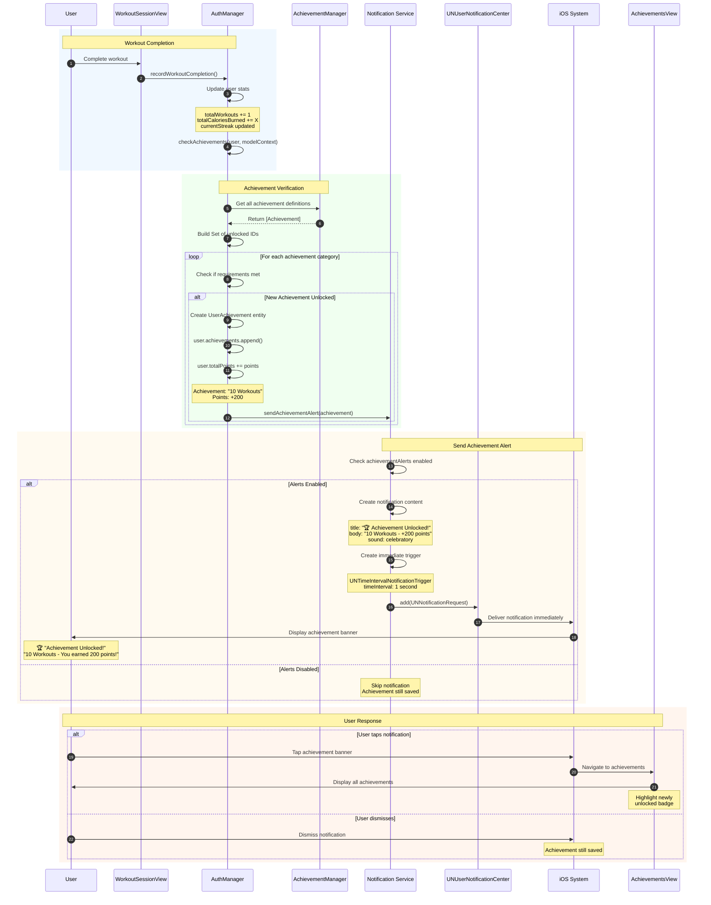

# Sequence Diagram: Achievement Alerts

## Scientific Paper Description

Figure X illustrates the sequence diagram for the Achievement Alerts notification subsystem within the WorkHome fitness application. Unlike time-based notifications such as workout and meal reminders, achievement alerts implement an event-driven notification architecture that triggers immediately upon achievement unlock events. This reactive pattern ensures users receive instant gratification and positive reinforcement when they reach fitness milestones, which is psychologically important for maintaining long-term engagement with the application. The achievement alert system integrates directly with the achievement verification logic in AuthManager, creating a seamless flow from goal completion to celebratory notification.

The achievement alert flow demonstrates the coordination between the data persistence layer and the notification subsystem. When a user completes a workout, the AuthManager's `checkAchievements()` function evaluates whether any new achievements have been unlocked based on updated statistics (total workouts, streak count, etc.). If a new achievement is detected and the user has enabled achievement alerts, the system immediately dispatches a local notification containing the achievement title, description, and point value. This notification is delivered using UNTimeIntervalNotificationTrigger with a minimal delay (1 second), ensuring near-instantaneous delivery while allowing the notification system to properly queue the request. The deep-link payload directs users to the Achievements view where they can review their complete badge collection.

## Flow Description
This diagram shows how Achievement Alerts are triggered when users unlock new achievements and how they are delivered.

## Mermaid Sequence Diagram



## Components Involved

| Component | Type | Responsibility |
|-----------|------|----------------|
| **User** | Actor | Completes workout, receives alert |
| **WorkoutSessionView** | SwiftUI View | Triggers completion flow |
| **AuthManager** | ObservableObject | Records workout, checks achievements |
| **AchievementManager** | Static Registry | Provides achievement definitions |
| **NotificationService** | Service Class | Sends achievement notification |
| **UNUserNotificationCenter** | iOS Framework | Delivers notification |
| **AchievementsView** | SwiftUI View | Deep-link destination |

## Achievement Categories

| Category | Example | Trigger Condition |
|----------|---------|-------------------|
| **Workout Count** | "10 Workouts" | totalWorkouts >= 10 |
| **Streak** | "7-Day Streak" | currentStreak >= 7 |
| **Calories** | "10K Calories" | totalCaloriesBurned >= 10000 |
| **Special** | "Night Owl" | Workout after 9 PM |

## Key Implementation Code

### 1. Toggle State Binding
**File:** `ProfileView.swift`

```swift
@State private var achievementAlerts: Bool = true

NotificationToggleRow(
    icon: "trophy.fill", 
    label: "Achievement Alerts", 
    isOn: $achievementAlerts
)
```

### 2. Check Achievements After Workout
**File:** `AuthManager.swift`

Called after every workout completion:

```swift
func recordWorkoutCompletion(
    workoutType: String,
    duration: Int,
    caloriesBurned: Int,
    exercisesCompleted: Int,
    modelContext: ModelContext
) {
    guard let user = currentUser else { return }
    
    // Update stats
    user.totalWorkouts += 1
    user.totalCaloriesBurned += caloriesBurned
    user.totalPoints += 50
    
    // Check for new achievements
    checkAchievements(for: user, modelContext: modelContext)
    
    try? modelContext.save()
}
```

### 3. Achievement Verification & Alert Trigger
**File:** `AuthManager.swift`

Check and trigger notification for new achievements:

```swift
private func checkAchievements(for user: User, modelContext: ModelContext) {
    let unlockedIds = Set(user.achievements.map { $0.achievementId })
    
    let workoutAchievements = [
        ("workout_1", 1), ("workout_10", 10), 
        ("workout_50", 50), ("workout_100", 100)
    ]
    
    for (achievementId, requirement) in workoutAchievements {
        if !unlockedIds.contains(achievementId) && 
           user.totalWorkouts >= requirement {
            
            // Create achievement record
            let achievement = UserAchievement(
                achievementId: achievementId,
                progress: user.totalWorkouts
            )
            user.achievements.append(achievement)
            
            // Get achievement definition
            if let achDef = AchievementManager.achievement(for: achievementId) {
                user.totalPoints += achDef.points
                
                // Send notification if enabled
                if user.achievementAlerts {
                    NotificationService.shared.sendAchievementAlert(
                        title: achDef.title,
                        points: achDef.points
                    )
                }
            }
        }
    }
}
```

### 4. Send Achievement Notification
**File:** `NotificationService.swift`

Immediate notification delivery:

```swift
func sendAchievementAlert(title: String, points: Int) {
    let center = UNUserNotificationCenter.current()
    
    let content = UNMutableNotificationContent()
    content.title = "🏆 Achievement Unlocked!"
    content.body = "\(title) - You earned \(points) points!"
    content.sound = UNNotificationSound(named: UNNotificationSoundName("celebration.wav"))
    content.userInfo = ["destination": "achievements"]
    
    // Trigger immediately (1 second delay)
    let trigger = UNTimeIntervalNotificationTrigger(
        timeInterval: 1,
        repeats: false
    )
    
    let request = UNNotificationRequest(
        identifier: "achievement_\(UUID().uuidString)",
        content: content,
        trigger: trigger
    )
    
    center.add(request)
}
```

### 5. Handle Achievement Notification Tap
**File:** `AppDelegate.swift`

Navigate to achievements view:

```swift
func userNotificationCenter(
    _ center: UNUserNotificationCenter,
    didReceive response: UNNotificationResponse
) async {
    let userInfo = response.notification.request.content.userInfo
    
    if let destination = userInfo["destination"] as? String,
       destination == "achievements" {
        NotificationCenter.default.post(
            name: .navigateToAchievements,
            object: nil
        )
    }
}
```

## Event-Driven vs Time-Based

```
┌─────────────────────────────────────────────────────────────┐
│           ACHIEVEMENT ALERT ARCHITECTURE                    │
├─────────────────────────────────────────────────────────────┤
│                                                             │
│  TIME-BASED (Workout/Meal Reminders)                        │
│  ┌─────────┐    ┌─────────┐    ┌─────────┐                 │
│  │ Schedule│───▶│ Wait for│───▶│ Deliver │                 │
│  │ at time │    │  time   │    │  alert  │                 │
│  └─────────┘    └─────────┘    └─────────┘                 │
│                                                             │
│  EVENT-DRIVEN (Achievement Alerts)                          │
│  ┌─────────┐    ┌─────────┐    ┌─────────┐                 │
│  │ User    │───▶│ Check   │───▶│ Deliver │                 │
│  │ action  │    │ unlock  │    │  INSTANT│                 │
│  └─────────┘    └─────────┘    └─────────┘                 │
│                                                             │
└─────────────────────────────────────────────────────────────┘
```

## Code Summary Table

| # | Code Section | File | Purpose |
|---|--------------|------|---------|
| 1 | Achievement toggle | ProfileView.swift | Enable/disable alerts |
| 2 | `recordWorkoutCompletion()` | AuthManager.swift | Trigger achievement check |
| 3 | `checkAchievements()` | AuthManager.swift | Verify & trigger notification |
| 4 | `sendAchievementAlert()` | NotificationService.swift | Immediate notification |
| 5 | `didReceive response` | AppDelegate.swift | Deep link to achievements |
