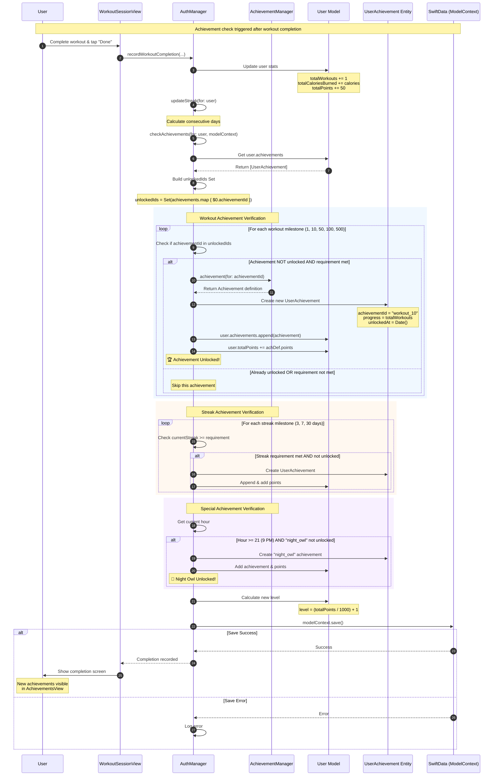

# Sequence Diagram: Achievement Unlock System

## Scientific Paper Description

Figure X illustrates the sequence diagram for the achievement unlock system within the WorkHome fitness application. The gamification engine operates as an event-driven verification system that evaluates user progress against predefined achievement criteria following significant user actions, such as workout completion. The AuthManager's `checkAchievements` method serves as the central orchestrator, systematically iterating through achievement categories—including workout milestones, streak progression, and time-based challenges—to determine eligibility for new unlocks. The system maintains an efficient lookup mechanism by first constructing a Set of previously unlocked achievement IDs from the user's achievement history, enabling O(1) complexity checks to prevent duplicate awards and unnecessary database operations.

The achievement verification process employs a declarative pattern where achievement definitions are maintained in the static AchievementManager registry, separating achievement metadata (titles, descriptions, point values, and requirements) from the runtime checking logic. When a user meets an achievement's requirements, the system instantiates a new UserAchievement entity linked to the User through SwiftData's @Relationship mechanism, appends it to the user's achievements array, and awards the corresponding bonus points. Subsequently, the user's level is recalculated based on their total accumulated points using the formula `level = (totalPoints / 1000) + 1`, implementing a progressive leveling system that rewards sustained engagement. All state mutations are atomically persisted through SwiftData's ModelContext, ensuring data consistency between the achievement records, point totals, and level progression.

## Flow Description
This diagram shows how achievements are checked and unlocked after user actions like completing workouts.

## Mermaid Sequence Diagram



## Components Involved

| Component | Type | Responsibility |
|-----------|------|----------------|
| **User** | Actor | Performs actions that trigger achievement checks |
| **WorkoutSessionView** | SwiftUI View | Triggers workout completion event |
| **AuthManager** | ObservableObject | Orchestrates achievement verification logic |
| **AchievementManager** | Static Registry | Stores achievement definitions & metadata |
| **User Model** | SwiftData @Model | Maintains user stats, achievements, level |
| **UserAchievement** | SwiftData @Model | Individual achievement record entity |
| **SwiftData** | Persistence | Atomic persistence of all changes |

## Achievement Categories

### Workout Milestones
| Achievement ID | Requirement | Points |
|---------------|-------------|--------|
| `workout_1` | 1 workout | 50 |
| `workout_10` | 10 workouts | 200 |
| `workout_50` | 50 workouts | 500 |
| `workout_100` | 100 workouts | 1000 |
| `workout_500` | 500 workouts | 2500 |

### Streak Achievements
| Achievement ID | Requirement | Points |
|---------------|-------------|--------|
| `streak_3` | 3-day streak | 100 |
| `streak_7` | 7-day streak | 250 |
| `streak_30` | 30-day streak | 1000 |

### Special Achievements
| Achievement ID | Condition | Points |
|---------------|-----------|--------|
| `night_owl` | Workout after 9 PM | 100 |

### Weight & Steps (Future)
| Achievement ID | Requirement | Points |
|---------------|-------------|--------|
| `weight_1` | Lose 1 kg | 200 |
| `steps_10k` | 10,000 steps/day | 150 |

## Data Model

```swift
// UserAchievement Entity
@Model
class UserAchievement {
    var id: UUID
    var achievementId: String      // Links to AchievementManager
    var unlockedAt: Date           // Timestamp of unlock
    var progress: Int              // Progress at time of unlock
    
    @Relationship(inverse: \User.achievements)
    var user: User?
}

// Achievement Definition (Static)
struct Achievement {
    let id: String
    let title: String
    let description: String
    let iconName: String
    let category: AchievementCategory
    let requirement: Int
    let points: Int
}
```

## Verification Algorithm

```
checkAchievements(user, modelContext):
    
    1. Build Set of already unlocked IDs
       unlockedIds = Set(user.achievements.map { achievementId })
    
    2. For each achievement category:
       ┌─────────────────────────────────────────┐
       │  WORKOUT: Check totalWorkouts >= req    │
       │  STREAK:  Check currentStreak >= req    │
       │  SPECIAL: Check time/condition met      │
       └─────────────────────────────────────────┘
    
    3. For each eligible achievement:
       IF achievementId NOT in unlockedIds:
           - Create UserAchievement entity
           - Append to user.achievements
           - Add bonus points to user.totalPoints
    
    4. Recalculate user level:
       user.level = (totalPoints / 1000) + 1
    
    5. Persist all changes:
       modelContext.save()
```

## Points & Leveling System

```
┌────────────────────────────────────────┐
│         LEVELING FORMULA               │
├────────────────────────────────────────┤
│  Level = (Total Points / 1000) + 1     │
│                                        │
│  Level 1:    0 - 999 points           │
│  Level 2: 1000 - 1999 points          │
│  Level 3: 2000 - 2999 points          │
│  ...                                   │
└────────────────────────────────────────┘

Point Sources:
├── Workout completion: +50 base points
├── Achievement unlocks: +50 to +2500 points
└── Streak bonuses: +100 to +1000 points
```

## Key Implementation Code

### 1. Achievement Definitions Registry
**File:** `UserAchievement.swift`

Static registry of all available achievements:

```swift
struct AchievementManager {
    static let allAchievements: [Achievement] = [
        // Streak Achievements
        Achievement(id: "streak_3", title: "3-Day Streak", 
                    description: "Workout 3 days in a row",
                    iconName: "flame.fill", category: .streak, 
                    requirement: 3, points: 100),
        Achievement(id: "streak_7", title: "7-Day Streak", 
                    requirement: 7, points: 250),
        
        // Workout Achievements
        Achievement(id: "workout_1", title: "First Workout", 
                    requirement: 1, points: 50),
        Achievement(id: "workout_10", title: "10 Workouts", 
                    requirement: 10, points: 200),
        Achievement(id: "workout_100", title: "100 Workouts", 
                    requirement: 100, points: 1000),
    ]
    
    static func achievement(for id: String) -> Achievement? {
        allAchievements.first { $0.id == id }
    }
}
```

### 2. Check Achievements Function
**File:** `AuthManager.swift`

Core verification logic with O(1) duplicate checking:

```swift
private func checkAchievements(for user: User, modelContext: ModelContext) {
    let unlockedIds = Set(user.achievements.map { $0.achievementId })
    
    // Check workout achievements
    let workoutAchievements = [
        ("workout_1", 1), ("workout_10", 10), 
        ("workout_50", 50), ("workout_100", 100)
    ]
    
    for (achievementId, requirement) in workoutAchievements {
        if !unlockedIds.contains(achievementId) && 
           user.totalWorkouts >= requirement {
            let achievement = UserAchievement(
                achievementId: achievementId, 
                progress: user.totalWorkouts
            )
            user.achievements.append(achievement)
            
            if let achDef = AchievementManager.achievement(for: achievementId) {
                user.totalPoints += achDef.points
            }
        }
    }
}
```

### 3. Streak Achievement Verification
**File:** `AuthManager.swift`

Checks consecutive workout days:

```swift
// Check streak achievements
let streakAchievements = [
    ("streak_3", 3), ("streak_7", 7), ("streak_30", 30)
]

for (achievementId, requirement) in streakAchievements {
    if !unlockedIds.contains(achievementId) && 
       user.currentStreak >= requirement {
        let achievement = UserAchievement(
            achievementId: achievementId, 
            progress: user.currentStreak
        )
        user.achievements.append(achievement)
        
        if let achDef = AchievementManager.achievement(for: achievementId) {
            user.totalPoints += achDef.points
        }
    }
}
```

### 4. Special Time-Based Achievement
**File:** `AuthManager.swift`

Night Owl achievement checks current hour:

```swift
// Check night owl achievement
let hour = Calendar.current.component(.hour, from: Date())
if !unlockedIds.contains("night_owl") && hour >= 21 {
    let achievement = UserAchievement(
        achievementId: "night_owl", 
        progress: 1
    )
    user.achievements.append(achievement)
    
    if let achDef = AchievementManager.achievement(for: "night_owl") {
        user.totalPoints += achDef.points
    }
}
```

### 5. Level Calculation
**File:** `AuthManager.swift`

Progressive leveling based on total points:

```swift
// Update level based on points
user.level = (user.totalPoints / 1000) + 1
```

### 6. UserAchievement Entity
**File:** `UserAchievement.swift`

SwiftData model for tracking unlocked achievements:

```swift
@Model
final class UserAchievement {
    var id: UUID
    var achievementId: String
    var unlockedAt: Date
    var progress: Int
    
    @Relationship(inverse: \User.achievements) var user: User?
    
    init(achievementId: String, progress: Int = 0) {
        self.id = UUID()
        self.achievementId = achievementId
        self.progress = progress
        self.unlockedAt = Date()
    }
}
```

## Code Summary Table

| # | Code Section | File | Purpose |
|---|--------------|------|---------|
| 1 | `AchievementManager` | UserAchievement.swift | Static achievement definitions registry |
| 2 | `checkAchievements()` | AuthManager.swift | Core verification with Set lookup |
| 3 | Streak verification loop | AuthManager.swift | Check consecutive day streaks |
| 4 | Night owl check | AuthManager.swift | Time-based special achievement |
| 5 | Level calculation | AuthManager.swift | Points-based progression |
| 6 | `UserAchievement` model | UserAchievement.swift | SwiftData entity for unlocks |
