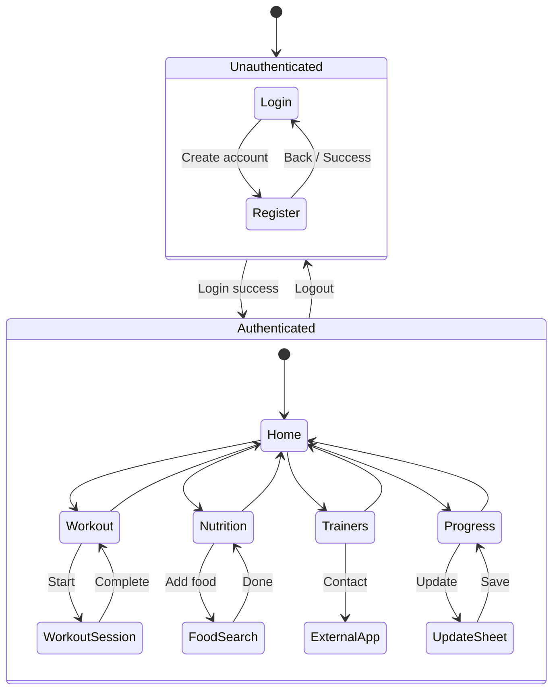

# State Diagram: WorkHome Fitness Application

## Scientific Paper Description

Figure X presents the comprehensive state diagram for the WorkHome fitness application, illustrating the finite state machine that governs the application's behavioral transitions throughout the user journey. The application implements a hierarchical state architecture with two primary super-states: the **Unauthenticated State** encompassing login and registration flows, and the **Authenticated State** containing the main application functionality accessed through a tab-based navigation paradigm. The transition between these super-states is controlled by the AuthManager's `isLoggedIn` boolean property, which serves as the primary guard condition evaluated by the ContentView root component. This design pattern ensures secure access control while maintaining a clear separation between public and protected application areas.

Within the Authenticated super-state, the application employs a concurrent state model where users can navigate freely between five primary states corresponding to the main tab destinations: Home, Workout, Nutrition, Trainers, and Progress. Each tab state contains nested sub-states representing modal presentations, sheet displays, and navigation stack pushes. The state transitions are triggered by user interactions (tap events), system events (timer completions, API responses), and data mutations (achievement unlocks, workout completions). The diagram demonstrates the application's reactive architecture, where SwiftUI's declarative state management (@State, @Binding, @Published) automatically synchronizes the user interface with the underlying state machine, eliminating the need for explicit state transition handlers while maintaining predictable application behavior.

The application further implements transient states for asynchronous operations such as API calls to the USDA Food Database and HealthKit data synchronization. These transient states (Loading, Searching, Syncing) provide visual feedback through loading indicators and prevent user interaction with incomplete data. Error states are handled through alert presentations that return users to their previous stable state upon dismissal. The state diagram also captures the deep linking capability for external application handoffs when contacting trainers via WhatsApp or Telegram, representing an exit point from the application's state machine with potential re-entry upon user return.

## Mermaid State Diagram

```mermaid
stateDiagram-v2
    [*] --> AppLaunch
    
    AppLaunch --> CheckingAuth: App starts
    
    state CheckingAuth {
        [*] --> LoadingUserDefaults
        LoadingUserDefaults --> CheckIsLoggedIn
    }
    
    CheckingAuth --> Unauthenticated: isLoggedIn = false
    CheckingAuth --> Authenticated: isLoggedIn = true
    
    %% ==========================================
    %% UNAUTHENTICATED SUPER-STATE
    %% ==========================================
    state Unauthenticated {
        [*] --> LoginScreen
        
        state LoginScreen {
            [*] --> LoginIdle
            LoginIdle --> LoginValidating: Tap "Sign In"
            LoginValidating --> LoginLoading: Validation passed
            LoginValidating --> LoginError: Validation failed
            LoginLoading --> LoginSuccess: Credentials valid
            LoginLoading --> LoginError: Invalid credentials
            LoginError --> LoginIdle: Dismiss error
        }
        
        LoginScreen --> RegisterScreen: Tap "Create Account"
        RegisterScreen --> LoginScreen: Tap "Back to Login"
        RegisterScreen --> LoginScreen: Registration success
        
        state RegisterScreen {
            [*] --> RegisterIdle
            RegisterIdle --> RegisterValidating: Tap "Create Account"
            RegisterValidating --> RegisterLoading: All fields valid
            RegisterValidating --> RegisterError: Validation failed
            RegisterLoading --> RegisterSuccess: Account created
            RegisterLoading --> RegisterError: Email exists
            RegisterError --> RegisterIdle: Dismiss error
            RegisterSuccess --> [*]: Navigate to Login
        }
    }
    
    Unauthenticated --> Authenticated: Login successful
    
    %% ==========================================
    %% AUTHENTICATED SUPER-STATE
    %% ==========================================
    state Authenticated {
        [*] --> MainTabs
        
        state MainTabs {
            [*] --> HomeTab
            
            HomeTab --> WorkoutTab: Select Workout tab
            HomeTab --> NutritionTab: Select Nutrition tab
            HomeTab --> TrainersTab: Select Trainers tab
            HomeTab --> ProgressTab: Select Progress tab
            
            WorkoutTab --> HomeTab: Select Home tab
            WorkoutTab --> NutritionTab: Select Nutrition tab
            WorkoutTab --> TrainersTab: Select Trainers tab
            WorkoutTab --> ProgressTab: Select Progress tab
            
            NutritionTab --> HomeTab: Select Home tab
            NutritionTab --> WorkoutTab: Select Workout tab
            NutritionTab --> TrainersTab: Select Trainers tab
            NutritionTab --> ProgressTab: Select Progress tab
            
            TrainersTab --> HomeTab: Select Home tab
            TrainersTab --> WorkoutTab: Select Workout tab
            TrainersTab --> NutritionTab: Select Nutrition tab
            TrainersTab --> ProgressTab: Select Progress tab
            
            ProgressTab --> HomeTab: Select Home tab
            ProgressTab --> WorkoutTab: Select Workout tab
            ProgressTab --> NutritionTab: Select Nutrition tab
            ProgressTab --> TrainersTab: Select Trainers tab
        }
        
        %% HOME TAB STATES
        state HomeTab {
            [*] --> HomeIdle
            HomeIdle --> HealthKitSync: onAppear
            HealthKitSync --> HomeIdle: Data loaded
            HomeIdle --> ProfileSheet: Tap profile
            ProfileSheet --> HomeIdle: Dismiss
            HomeIdle --> QuickWorkout: Tap "Start Workout"
        }
        
        %% WORKOUT TAB STATES
        state WorkoutTab {
            [*] --> WorkoutList
            WorkoutList --> WorkoutDetail: Select workout
            WorkoutDetail --> WorkoutList: Cancel
            WorkoutDetail --> WorkoutSession: Start workout
            
            state WorkoutSession {
                [*] --> ExerciseActive
                ExerciseActive --> ExercisePaused: Tap pause
                ExercisePaused --> ExerciseActive: Tap play
                ExerciseActive --> RestPeriod: Exercise complete
                RestPeriod --> ExerciseActive: Rest complete
                ExerciseActive --> WorkoutComplete: Last exercise done
            }
            
            WorkoutComplete --> WorkoutList: Tap "Done"
        }
        
        %% NUTRITION TAB STATES
        state NutritionTab {
            [*] --> NutritionOverview
            NutritionOverview --> FoodSearch: Tap add food
            
            state FoodSearch {
                [*] --> SearchIdle
                SearchIdle --> Searching: Type query
                Searching --> SearchResults: Results received
                Searching --> SearchEmpty: No results
                SearchResults --> SearchIdle: Clear search
                SearchResults --> FoodDetail: Select food
            }
            
            FoodDetail --> ServingSheet: Show serving selector
            ServingSheet --> NutritionOverview: Add food
            ServingSheet --> FoodSearch: Cancel
            FoodSearch --> NutritionOverview: Dismiss
        }
        
        %% TRAINERS TAB STATES
        state TrainersTab {
            [*] --> TrainersList
            TrainersList --> TrainerProfile: Select trainer
            TrainerProfile --> TrainersList: Back
            TrainerProfile --> ExternalApp: Contact trainer
        }
        
        %% PROGRESS TAB STATES
        state ProgressTab {
            [*] --> ProgressOverview
            ProgressOverview --> UpdateMeasurements: Tap "Update"
            UpdateMeasurements --> ProgressOverview: Save/Cancel
            ProgressOverview --> AchievementsView: Tap achievements
            AchievementsView --> ProgressOverview: Back
        }
    }
    
    Authenticated --> Unauthenticated: Logout
    
    %% External transitions
    ExternalApp --> [*]: Open WhatsApp/Telegram
```



## Simplified High-Level State Diagram



## State Categories

### 1. Authentication States
| State | Description | Entry Condition | Exit Condition |
|-------|-------------|-----------------|----------------|
| `LoginIdle` | Ready for user input | App launch / Logout | Tap Sign In |
| `LoginValidating` | Checking form validity | Submit form | Validation complete |
| `LoginLoading` | Authenticating with DB | Valid form | Auth response |
| `LoginSuccess` | Credentials accepted | Valid login | Transition to Main |
| `LoginError` | Invalid credentials | Auth failed | User dismisses |
| `RegisterIdle` | Registration form ready | Tap Create Account | Submit form |
| `RegisterLoading` | Creating account | Valid form | DB response |
| `RegisterSuccess` | Account created | Insert success | Navigate to Login |

### 2. Main Navigation States
| State | Tab Index | Primary View | Key Actions |
|-------|-----------|--------------|-------------|
| `HomeTab` | 0 | HomeView | View stats, quick workout |
| `WorkoutTab` | 1 | WorkoutListView | Browse & start workouts |
| `NutritionTab` | 2 | NutritionView | Log food, track calories |
| `TrainersTab` | 3 | TrainersListView | Find & contact trainers |
| `ProgressTab` | 4 | UserProgressView | Track measurements |

### 3. Workout Session States
| State | Description | Duration | Transition |
|-------|-------------|----------|------------|
| `ExerciseActive` | Performing exercise | 30 seconds | Timer complete |
| `ExercisePaused` | Timer paused | Indefinite | User resumes |
| `RestPeriod` | Between exercises | 15 seconds | Timer/Skip |
| `WorkoutComplete` | All exercises done | User action | Tap Done |

### 4. Food Search States
| State | Description | Trigger |
|-------|-------------|---------|
| `SearchIdle` | Empty search field | Initial / Clear |
| `Searching` | API request in progress | Text input |
| `SearchResults` | Foods displayed | API success |
| `SearchEmpty` | No matches found | Empty response |
| `FoodDetail` | Viewing food item | Select food |
| `ServingSheet` | Adjusting servings | Add to meal |

## State Transition Guards

```swift
// Authentication guard
if authManager.isLoggedIn {
    → Authenticated state
} else {
    → Unauthenticated state
}

// Workout progression guard
if currentExerciseIndex < exercises.count - 1 {
    → RestPeriod state
} else {
    → WorkoutComplete state
}

// Food search guard
if !searchText.isEmpty {
    → Searching state
} else {
    → SearchIdle state
}
```

## State Persistence

| State Data | Storage | Persistence |
|------------|---------|-------------|
| `isLoggedIn` | UserDefaults | Across launches |
| `currentUserID` | UserDefaults | Across launches |
| User profile | SwiftData | Permanent |
| Workout history | SwiftData | Permanent |
| Achievements | SwiftData | Permanent |
| Tab selection | @State | Session only |
| Search text | @State | View lifetime |
| Modal states | @State | View lifetime |

## State Management Architecture

```
┌─────────────────────────────────────────────────────────────┐
│                    APPLICATION STATES                        │
├─────────────────────────────────────────────────────────────┤
│                                                             │
│  ┌─────────────────────────────────────────────────────┐   │
│  │              UNAUTHENTICATED                         │   │
│  │  ┌───────────┐         ┌───────────────┐            │   │
│  │  │   Login   │ ←─────→ │   Register    │            │   │
│  │  │  Screen   │         │    Screen     │            │   │
│  │  └─────┬─────┘         └───────────────┘            │   │
│  └────────│────────────────────────────────────────────┘   │
│           │ Login Success                                   │
│           ▼                                                 │
│  ┌─────────────────────────────────────────────────────┐   │
│  │               AUTHENTICATED                          │   │
│  │                                                      │   │
│  │   ┌──────┐ ┌─────────┐ ┌──────────┐ ┌────────┐     │   │
│  │   │ Home │ │ Workout │ │Nutrition │ │Trainers│     │   │
│  │   └──┬───┘ └────┬────┘ └────┬─────┘ └───┬────┘     │   │
│  │      │          │           │           │          │   │
│  │      │    ┌─────┴─────┐ ┌───┴────┐  ┌───┴────┐    │   │
│  │      │    │  Workout  │ │  Food  │  │Trainer │    │   │
│  │      │    │  Session  │ │ Search │  │Profile │    │   │
│  │      │    └───────────┘ └────────┘  └───┬────┘    │   │
│  │      │                                   │         │   │
│  │      │                              ┌────┴────┐    │   │
│  │      │                              │External │    │   │
│  │      │                              │  App    │    │   │
│  │      │                              └─────────┘    │   │
│  │   ┌──┴────────────────────────────────────────┐   │   │
│  │   │               Progress Tab                │   │   │
│  │   │  ┌────────────┐    ┌──────────────────┐   │   │   │
│  │   │  │   Update   │    │   Achievements   │   │   │   │
│  │   │  │Measurements│    │      View        │   │   │   │
│  │   │  └────────────┘    └──────────────────┘   │   │   │
│  │   └───────────────────────────────────────────┘   │   │
│  │                                                    │   │
│  └────────────────────────────────────────────────────┘   │
│                                                             │
└─────────────────────────────────────────────────────────────┘
```

## SwiftUI State Bindings

```swift
// Root level state control
ContentView
├── @ObservedObject authManager.isLoggedIn
│   ├── false → LoginView
│   └── true → MainTabView
│
MainTabView
├── @State selectedTab: Int
│   ├── 0 → HomeView
│   ├── 1 → WorkoutListView
│   ├── 2 → NutritionView
│   ├── 3 → TrainersListView
│   └── 4 → UserProgressView
│
WorkoutListView
├── @State showWorkoutDetail: Bool
├── @State showWorkoutSession: Bool
└── @State selectedWorkout: WorkoutType
│
NutritionView
├── @State showFoodSearch: Bool
└── @State selectedMealType: MealType
│
UserProgressView
├── @State showUpdateModal: Bool
├── @State newWeight: Double
└── @State newHeight: Double
```
