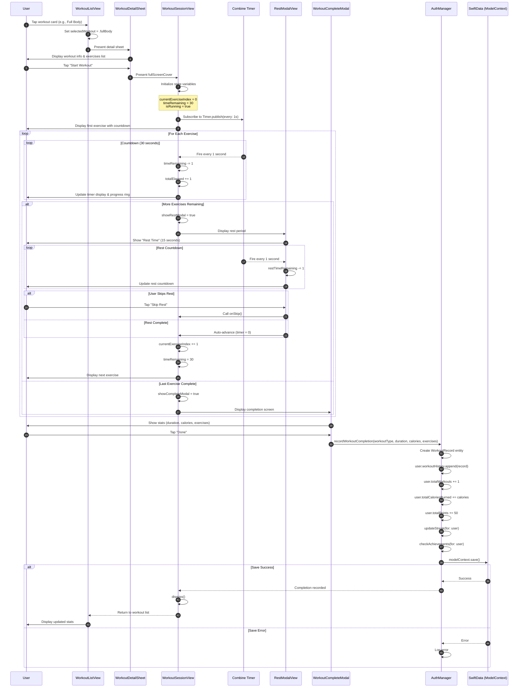

# Sequence Diagram: Completing a Workout Session

## Scientific Paper Description

Figure X illustrates the sequence diagram for completing a workout session within the WorkHome fitness application. The workout session flow begins when the user selects a workout type from the WorkoutListView and initiates the session through the WorkoutDetailSheet. The WorkoutSessionView component manages the entire exercise lifecycle using a Timer-based state machine that orchestrates exercise timing, rest periods, and progression through the exercise list. The system employs SwiftUI's `onReceive` modifier to subscribe to a Combine Timer publisher, which fires every second to update the countdown timer, track elapsed time, and automatically trigger state transitions between exercise execution, rest periods, and workout completion phases.

Upon completing all exercises, the application presents the WorkoutCompleteModal displaying session statistics including total duration, calories burned, and number of exercises completed. When the user confirms completion by tapping the "Done" button, the system invokes the AuthManager's `recordWorkoutCompletion` method, which persists the workout data using SwiftData. This method creates a new WorkoutRecord entity, updates the user's cumulative statistics (total workouts, calories burned, and points), recalculates the user's workout streak based on consecutive daily activity, and triggers achievement verification logic. The use of SwiftData's ModelContext ensures atomic persistence of all related data changes, maintaining data integrity across the user profile and workout history relationships.

## Flow Description
This diagram shows the complete flow from starting a workout to recording its completion in the database.

## Mermaid Sequence Diagram



## Components Involved

| Component | Type | Responsibility |
|-----------|------|----------------|
| **User** | Actor | Performs exercises, controls workout flow |
| **WorkoutListView** | SwiftUI View | Displays available workouts |
| **WorkoutDetailSheet** | SwiftUI View | Shows workout preview & start button |
| **WorkoutSessionView** | SwiftUI View | Main workout interface with timer |
| **Combine Timer** | Publisher | Fires every second for countdown |
| **RestModalView** | SwiftUI View | Rest period between exercises |
| **WorkoutCompleteModal** | SwiftUI View | Completion screen with stats |
| **AuthManager** | ObservableObject | Business logic, user data management |
| **SwiftData** | Persistence | Stores workout records & user stats |

## Key State Variables

1. **WorkoutSessionView State:**
   - `currentExerciseIndex`: Current exercise position (0-based)
   - `timeRemaining`: Countdown seconds for current exercise
   - `isRunning`: Play/pause state
   - `totalElapsed`: Total seconds since workout started
   - `showRestModal`: Controls rest period display
   - `showCompleteModal`: Controls completion screen

2. **Timer Configuration:**
   - Exercise duration: 30 seconds
   - Rest duration: 15 seconds
   - Timer frequency: 1 second intervals

## Data Persistence

```
WorkoutRecord {
    id: UUID
    workoutType: String
    duration: Int (minutes)
    caloriesBurned: Int
    exercisesCompleted: Int
    completedAt: Date
}

User Updates:
├── workoutHistory.append(record)
├── totalWorkouts += 1
├── totalCaloriesBurned += calories
├── totalPoints += 50
├── streak calculation
└── achievement checks
```

## Key Implementation Code

### 1. Timer-Based State Machine
**File:** `WorkoutSessionView.swift`

The workout session uses Combine's Timer publisher for countdown management:

```swift
struct WorkoutSessionView: View {
    @State private var currentExerciseIndex: Int = 0
    @State private var timeRemaining: Int = 30
    @State private var isRunning: Bool = true
    @State private var totalElapsed: Int = 0
    @State private var showRestModal: Bool = false
    @State private var showCompleteModal: Bool = false
    
    let exerciseDuration: Int = 30
    let restDuration: Int = 15
    
    let timer = Timer.publish(every: 1, on: .main, in: .common).autoconnect()
}
```

### 2. Timer Event Handler
**File:** `WorkoutSessionView.swift`

The onReceive modifier processes timer events and manages state transitions:

```swift
.onReceive(timer) { _ in
    guard isRunning && !showRestModal && !showCompleteModal else { return }
    
    if timeRemaining > 0 {
        timeRemaining -= 1
        totalElapsed += 1
    } else {
        // Exercise complete
        if currentExerciseIndex < exercises.count - 1 {
            showRestModal = true
            restTimeRemaining = restDuration
        } else {
            showCompleteModal = true
        }
    }
}
```

### 3. Recording Workout Completion
**File:** `WorkoutSessionView.swift`

Completion modal triggers the persistence flow:

```swift
WorkoutCompleteModal(
    duration: totalDuration,
    calories: workoutType.calories,
    exercises: exercises.count,
    onDone: {
        authManager.recordWorkoutCompletion(
            workoutType: workoutType.rawValue,
            duration: totalDuration / 60,
            caloriesBurned: workoutType.calories,
            exercisesCompleted: exercises.count,
            modelContext: modelContext
        )
        dismiss()
    }
)
```

### 4. Persisting Workout Data
**File:** `AuthManager.swift`

The AuthManager handles data persistence and triggers achievement checks:

```swift
func recordWorkoutCompletion(
    workoutType: String,
    duration: Int,
    caloriesBurned: Int,
    exercisesCompleted: Int,
    modelContext: ModelContext
) {
    guard let user = currentUser else { return }
    
    let record = WorkoutRecord(
        workoutType: workoutType,
        duration: duration,
        caloriesBurned: caloriesBurned,
        exercisesCompleted: exercisesCompleted
    )
    
    user.workoutHistory.append(record)
    user.totalWorkouts += 1
    user.totalCaloriesBurned += caloriesBurned
    user.totalPoints += 50
    
    updateStreak(for: user)
    checkAchievements(for: user, modelContext: modelContext)
    
    try? modelContext.save()
}
```

### 5. Rest Period Modal
**File:** `WorkoutSessionView.swift`

Rest modal with its own timer and skip functionality:

```swift
struct RestModalView: View {
    @Binding var timeRemaining: Int
    let nextExercise: String
    let onSkip: () -> Void
    
    let timer = Timer.publish(every: 1, on: .main, in: .common).autoconnect()
    
    var body: some View {
        // Rest UI...
    }
    .onReceive(timer) { _ in
        if timeRemaining > 0 {
            timeRemaining -= 1
        } else {
            onSkip()
        }
    }
}
```

## Code Summary Table

| # | Code Section | File | Purpose |
|---|--------------|------|---------|
| 1 | State variables & Timer | WorkoutSessionView.swift | Timer-based state machine setup |
| 2 | `.onReceive(timer)` | WorkoutSessionView.swift | Exercise/rest state transitions |
| 3 | `WorkoutCompleteModal.onDone` | WorkoutSessionView.swift | Trigger completion recording |
| 4 | `recordWorkoutCompletion()` | AuthManager.swift | Persist data & update stats |
| 5 | `RestModalView` | WorkoutSessionView.swift | Rest period with auto-advance |
