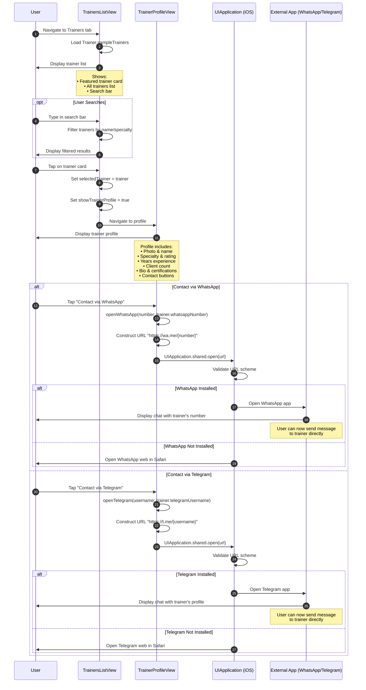

# Sequence Diagram: Contacting a Trainer

## Scientific Paper Description

Figure X illustrates the sequence diagram for the trainer contact functionality within the WorkHome fitness application. The trainer discovery and contact flow implements a hierarchical navigation pattern where users browse available trainers through the TrainersListView, which displays both featured and regular trainers with search filtering capabilities. The view maintains a collection of static Trainer objects containing professional information such as specialty, experience, ratings, and contact details. When a user selects a trainer, the application navigates to the TrainerProfileView, presenting comprehensive trainer information including biography, certifications, client statistics, and contact options, enabling users to make informed decisions before initiating contact.

The contact mechanism leverages iOS's deep linking capabilities through the UIApplication.shared.open() method to redirect users to external messaging applications. Two primary contact channels are supported: WhatsApp via the `wa.me` URL scheme and Telegram via the `t.me` URL scheme. This approach delegates the actual messaging functionality to established communication platforms, eliminating the need for in-app messaging infrastructure while providing users with familiar interfaces. The implementation includes platform-specific compilation directives (`#if os(iOS)`) to ensure compatibility across different Apple platforms, demonstrating defensive programming practices for cross-platform SwiftUI applications. Upon successful URL opening, the system transfers control to the external application with the trainer's contact information pre-populated, streamlining the user's communication workflow.

## Flow Description
This diagram shows the complete flow from browsing trainers to contacting them via WhatsApp or Telegram.

## Mermaid Sequence Diagram



## Components Involved

| Component | Type | Responsibility |
|-----------|------|----------------|
| **User** | Actor | Browses trainers and initiates contact |
| **TrainersListView** | SwiftUI View | Displays trainer list with search/filter |
| **TrainerProfileView** | SwiftUI View | Shows trainer details and contact buttons |
| **UIApplication** | iOS System | Opens external URLs/apps |
| **External App** | WhatsApp/Telegram | Handles actual messaging |

## Trainer Data Model

```swift
struct Trainer: Identifiable {
    let id: UUID
    let name: String
    let specialty: String
    let rating: Double
    let reviewCount: Int
    let yearsExperience: Int
    let clientCount: Int
    let imageURL: String
    let whatsappNumber: String      // For WhatsApp contact
    let telegramUsername: String    // For Telegram contact
    let isFeatured: Bool
    let bio: String
}
```

## State Management

### TrainersListView State
```swift
@State private var searchText: String = ""
@State private var selectedTrainer: Trainer?
@State private var showTrainerProfile: Bool = false

var filteredTrainers: [Trainer] {
    if searchText.isEmpty {
        return Trainer.sampleTrainers
    }
    return Trainer.sampleTrainers.filter {
        $0.name.lowercased().contains(searchText.lowercased()) ||
        $0.specialty.lowercased().contains(searchText.lowercased())
    }
}
```

## Contact Methods

### WhatsApp Integration
```swift
private func openWhatsApp(number: String) {
    #if os(iOS)
    if let url = URL(string: "https://wa.me/\(number)") {
        UIApplication.shared.open(url)
    }
    #endif
}
```

### Telegram Integration
```swift
private func openTelegram(username: String) {
    #if os(iOS)
    if let url = URL(string: "https://t.me/\(username)") {
        UIApplication.shared.open(url)
    }
    #endif
}
```

## URL Schemes

| Platform | URL Format | Example |
|----------|------------|---------|
| WhatsApp | `https://wa.me/{phone}` | `https://wa.me/1234567890` |
| Telegram | `https://t.me/{username}` | `https://t.me/mikejohnson` |

## Sample Trainers

| Name | Specialty | Rating | Contact |
|------|-----------|--------|---------|
| Mike Johnson | Strength & Conditioning | 4.9 ⭐ | Featured |
| Sarah Williams | Weight Loss Specialist | 4.8 ⭐ | Regular |
| David Chen | HIIT & Cardio Expert | 4.9 ⭐ | Regular |
| Emma Rodriguez | Yoga & Flexibility | 4.7 ⭐ | Regular |
| James Wilson | Home Workout Expert | 4.6 ⭐ | Regular |

## User Journey Flow

```
┌─────────────────────────────────────────────────────────┐
│           CONTACTING A TRAINER FLOW                     │
├─────────────────────────────────────────────────────────┤
│                                                         │
│  [Trainers Tab] → View all trainers                     │
│       │                                                 │
│       ▼                                                 │
│  [Search] → (Optional) Filter by name/specialty         │
│       │                                                 │
│       ▼                                                 │
│  [Select Trainer] → Tap on trainer card                 │
│       │                                                 │
│       ▼                                                 │
│  [View Profile] → Review trainer info                   │
│       │            ├── Photo & credentials              │
│       │            ├── Experience & ratings             │
│       │            ├── Bio & certifications             │
│       │            └── Contact buttons                  │
│       │                                                 │
│       ▼                                                 │
│  [Choose Contact] → WhatsApp OR Telegram                │
│       │                                                 │
│       ▼                                                 │
│  [Open External App] → UIApplication.shared.open()      │
│       │                                                 │
│       ▼                                                 │
│  [Message Trainer] → Chat in WhatsApp/Telegram          │
│                                                         │
└─────────────────────────────────────────────────────────┘
```

## Key Implementation Code

### 1. Trainer Data Model
**File:** `Trainer.swift`

Static data model with contact information:

```swift
struct Trainer: Identifiable {
    let id: UUID
    let name: String
    let specialty: String
    let rating: Double
    let reviewCount: Int
    let yearsExperience: Int
    let clientCount: Int
    let imageURL: String
    let whatsappNumber: String
    let telegramUsername: String
    let isFeatured: Bool
    let bio: String
}
```

### 2. Search Filter Implementation
**File:** `TrainersListView.swift`

Computed property filters trainers by name or specialty:

```swift
@State private var searchText: String = ""
@State private var selectedTrainer: Trainer?
@State private var showTrainerProfile: Bool = false

var filteredTrainers: [Trainer] {
    if searchText.isEmpty {
        return Trainer.sampleTrainers
    }
    return Trainer.sampleTrainers.filter {
        $0.name.lowercased().contains(searchText.lowercased()) ||
        $0.specialty.lowercased().contains(searchText.lowercased())
    }
}
```

### 3. Navigation to Profile
**File:** `TrainersListView.swift`

Navigation destination pattern for trainer selection:

```swift
ForEach(filteredTrainers) { trainer in
    TrainerCard(trainer: trainer) {
        selectedTrainer = trainer
        showTrainerProfile = true
    }
}

.navigationDestination(isPresented: $showTrainerProfile) {
    if let trainer = selectedTrainer {
        TrainerProfileView(trainer: trainer)
    }
}
```

### 4. WhatsApp Deep Link
**File:** `TrainerProfileView.swift`

Opens WhatsApp with trainer's number pre-filled:

```swift
private func openWhatsApp(number: String) {
    #if os(iOS)
    if let url = URL(string: "https://wa.me/\(number)") {
        UIApplication.shared.open(url)
    }
    #endif
}

// Button usage
Button(action: {
    openWhatsApp(number: trainer.whatsappNumber)
}) {
    HStack {
        Image(systemName: "message.fill")
        Text("Contact via WhatsApp")
    }
    .frame(maxWidth: .infinity)
    .padding(.vertical, 16)
    .background(Color.green)
    .foregroundColor(.white)
    .cornerRadius(16)
}
```

### 5. Telegram Deep Link
**File:** `TrainerProfileView.swift`

Opens Telegram with trainer's username:

```swift
private func openTelegram(username: String) {
    #if os(iOS)
    if let url = URL(string: "https://t.me/\(username)") {
        UIApplication.shared.open(url)
    }
    #endif
}

// Button usage
Button(action: {
    openTelegram(username: trainer.telegramUsername)
}) {
    HStack {
        Image(systemName: "paperplane.fill")
        Text("Contact via Telegram")
    }
    .frame(maxWidth: .infinity)
    .padding(.vertical, 16)
    .background(Color.blue)
    .foregroundColor(.white)
    .cornerRadius(16)
}
```

### 6. Platform Conditional Compilation
**File:** `TrainerProfileView.swift`

Cross-platform compatibility with compilation directives:

```swift
#if canImport(UIKit)
import UIKit
#endif

// Used in functions:
#if os(iOS)
    UIApplication.shared.open(url)
#endif
```

## Code Summary Table

| # | Code Section | File | Purpose |
|---|--------------|------|---------|
| 1 | `Trainer` struct | Trainer.swift | Data model with contact info |
| 2 | `filteredTrainers` | TrainersListView.swift | Search/filter computed property |
| 3 | Navigation destination | TrainersListView.swift | Profile navigation pattern |
| 4 | `openWhatsApp()` | TrainerProfileView.swift | WhatsApp URL scheme deep link |
| 5 | `openTelegram()` | TrainerProfileView.swift | Telegram URL scheme deep link |
| 6 | `#if os(iOS)` | TrainerProfileView.swift | Platform conditional compilation |
