# Sequence Diagram: Meal Reminders

## Scientific Paper Description

Figure X presents the sequence diagram for the Meal Reminders notification subsystem within the WorkHome fitness application. Unlike the single-occurrence workout reminder, the meal reminder system implements a multi-trigger architecture that schedules three distinct notifications corresponding to primary meal times: breakfast, lunch, and dinner. This design acknowledges the nutritional tracking requirements of fitness applications, where consistent meal logging is essential for accurate calorie and macronutrient monitoring. Each reminder is scheduled with a unique identifier and time-based trigger, allowing independent management of individual meal notifications.

The meal reminder implementation demonstrates advanced notification scheduling patterns using UNCalendarNotificationTrigger with specific hour configurations. Breakfast reminders are typically scheduled for morning hours (8:00 AM), lunch reminders for midday (12:00 PM), and dinner reminders for evening (6:00 PM). When the user enables meal reminders through the ProfileView toggle, the NotificationService iterates through the meal configuration array, creating and scheduling individual notification requests for each meal type. This batch scheduling approach ensures atomic preference management—enabling or disabling the toggle affects all three meal reminders simultaneously while maintaining the ability to extend the system with user-configurable meal times in future iterations.

## Flow Description
This diagram shows how Meal Reminders are scheduled for breakfast, lunch, and dinner, and how users interact with them.

## Mermaid Sequence Diagram

```mermaid
sequenceDiagram
    autonumber
    
    participant User
    participant ProfileView
    participant NotificationService as Notification Service
    participant UNCenter as UNUserNotificationCenter
    participant iOS as iOS System
    participant NutritionView
    
    %% Enabling Meal Reminders
    rect rgb(240, 248, 255)
        Note over User,UNCenter: Enable Meal Reminders
        
        User->>ProfileView: Toggle Meal Reminders ON
        ProfileView->>ProfileView: mealReminders = true
        ProfileView->>NotificationService: scheduleMealReminders()
        
        NotificationService->>UNCenter: requestAuthorization()
        UNCenter-->>NotificationService: authorized = true
        
        loop For each meal type
            Note over NotificationService: Breakfast (8:00 AM)<br/>Lunch (12:00 PM)<br/>Dinner (6:00 PM)
            
            NotificationService->>NotificationService: Create meal notification
            NotificationService->>UNCenter: add(UNNotificationRequest)
        end
        
        UNCenter-->>NotificationService: All 3 reminders scheduled
    end
    
    %% Breakfast Notification
    rect rgb(255, 250, 240)
        Note over iOS,User: Breakfast Reminder (8:00 AM)
        
        iOS->>iOS: Calendar trigger fires
        iOS->>User: Display notification
        Note over User: 🍳 "Breakfast Time!"<br/>"Log your morning meal"
        
        alt User taps notification
            User->>iOS: Tap notification
            iOS->>NutritionView: Navigate with mealType: breakfast
            NutritionView->>NutritionView: selectedMealType = .breakfast
            NutritionView->>NutritionView: showFoodSearch = true
            NutritionView->>User: Display food search for breakfast
        end
    end
    
    %% Lunch Notification
    rect rgb(240, 255, 240)
        Note over iOS,User: Lunch Reminder (12:00 PM)
        
        iOS->>iOS: Calendar trigger fires
        iOS->>User: Display notification
        Note over User: 🥗 "Lunch Time!"<br/>"Don't forget to log lunch"
        
        alt User taps notification
            User->>iOS: Tap notification
            iOS->>NutritionView: Navigate with mealType: lunch
            NutritionView->>User: Display food search for lunch
        end
    end
    
    %% Dinner Notification
    rect rgb(255, 245, 238)
        Note over iOS,User: Dinner Reminder (6:00 PM)
        
        iOS->>iOS: Calendar trigger fires
        iOS->>User: Display notification
        Note over User: 🍽️ "Dinner Time!"<br/>"Log your evening meal"
        
        alt User taps notification
            User->>iOS: Tap notification
            iOS->>NutritionView: Navigate with mealType: dinner
            NutritionView->>User: Display food search for dinner
        end
    end
    
    %% Disabling Reminders
    rect rgb(255, 240, 240)
        Note over User,UNCenter: Disable Meal Reminders
        
        User->>ProfileView: Toggle Meal Reminders OFF
        ProfileView->>ProfileView: mealReminders = false
        ProfileView->>NotificationService: cancelMealReminders()
        NotificationService->>UNCenter: removePendingNotificationRequests(["meal_breakfast", "meal_lunch", "meal_dinner"])
        UNCenter-->>NotificationService: All meal notifications cancelled
    end
```



## Components Involved

| Component | Type | Responsibility |
|-----------|------|----------------|
| **User** | Actor | Toggles preference, receives notifications |
| **ProfileView** | SwiftUI View | Manages toggle state |
| **NotificationService** | Service Class | Schedules/cancels notifications |
| **UNUserNotificationCenter** | iOS Framework | Manages notification delivery |
| **iOS System** | Operating System | Displays banners at scheduled times |
| **NutritionView** | SwiftUI View | Deep-link destination for meal logging |

## Meal Schedule Configuration

| Meal | Identifier | Time | Icon | Title |
|------|------------|------|------|-------|
| **Breakfast** | `meal_breakfast` | 8:00 AM | 🍳 | "Breakfast Time!" |
| **Lunch** | `meal_lunch` | 12:00 PM | 🥗 | "Lunch Time!" |
| **Dinner** | `meal_dinner` | 6:00 PM | 🍽️ | "Dinner Time!" |

## Key Implementation Code

### 1. Toggle State Binding
**File:** `ProfileView.swift`

```swift
@State private var mealReminders: Bool = true

NotificationToggleRow(
    icon: "fork.knife", 
    label: "Meal Reminders", 
    isOn: $mealReminders
)
.onChange(of: mealReminders) { _, newValue in
    if newValue {
        NotificationService.shared.scheduleMealReminders()
    } else {
        NotificationService.shared.cancelMealReminders()
    }
}
```

### 2. Meal Configuration Array
**File:** `NotificationService.swift`

Define meal types with their schedules:

```swift
struct MealReminderConfig {
    let identifier: String
    let title: String
    let body: String
    let hour: Int
    let minute: Int
    let mealType: Constants.MealType
}

let mealConfigs: [MealReminderConfig] = [
    MealReminderConfig(
        identifier: "meal_breakfast",
        title: "Breakfast Time! 🍳",
        body: "Start your day right - log your breakfast",
        hour: 8, minute: 0,
        mealType: .breakfast
    ),
    MealReminderConfig(
        identifier: "meal_lunch",
        title: "Lunch Time! 🥗",
        body: "Don't forget to log your lunch",
        hour: 12, minute: 0,
        mealType: .lunch
    ),
    MealReminderConfig(
        identifier: "meal_dinner",
        title: "Dinner Time! 🍽️",
        body: "Log your evening meal to stay on track",
        hour: 18, minute: 0,
        mealType: .dinner
    )
]
```

### 3. Schedule All Meal Reminders
**File:** `NotificationService.swift`

Batch schedule all three meal notifications:

```swift
func scheduleMealReminders() {
    let center = UNUserNotificationCenter.current()
    
    for config in mealConfigs {
        let content = UNMutableNotificationContent()
        content.title = config.title
        content.body = config.body
        content.sound = .default
        content.userInfo = [
            "destination": "nutrition",
            "mealType": config.mealType.rawValue
        ]
        
        var dateComponents = DateComponents()
        dateComponents.hour = config.hour
        dateComponents.minute = config.minute
        
        let trigger = UNCalendarNotificationTrigger(
            dateMatching: dateComponents,
            repeats: true
        )
        
        let request = UNNotificationRequest(
            identifier: config.identifier,
            content: content,
            trigger: trigger
        )
        
        center.add(request)
    }
}
```

### 4. Cancel All Meal Reminders
**File:** `NotificationService.swift`

Remove all meal notifications:

```swift
func cancelMealReminders() {
    let center = UNUserNotificationCenter.current()
    let identifiers = mealConfigs.map { $0.identifier }
    center.removePendingNotificationRequests(withIdentifiers: identifiers)
}
```

### 5. Handle Meal Notification Tap
**File:** `AppDelegate.swift`

Navigate to nutrition with correct meal type:

```swift
func userNotificationCenter(
    _ center: UNUserNotificationCenter,
    didReceive response: UNNotificationResponse
) async {
    let userInfo = response.notification.request.content.userInfo
    
    if let destination = userInfo["destination"] as? String,
       destination == "nutrition",
       let mealTypeRaw = userInfo["mealType"] as? String,
       let mealType = Constants.MealType(rawValue: mealTypeRaw) {
        
        NotificationCenter.default.post(
            name: .navigateToNutrition,
            object: mealType
        )
    }
}
```

## Code Summary Table

| # | Code Section | File | Purpose |
|---|--------------|------|---------|
| 1 | Toggle onChange | ProfileView.swift | Trigger batch schedule/cancel |
| 2 | `MealReminderConfig` | NotificationService.swift | Define meal time configurations |
| 3 | `scheduleMealReminders()` | NotificationService.swift | Loop and schedule all meals |
| 4 | `cancelMealReminders()` | NotificationService.swift | Remove all meal notifications |
| 5 | `didReceive response` | AppDelegate.swift | Deep link to specific meal |
