# Sequence Diagram: New User Registration

## Scientific Paper Description

Figure X illustrates the sequence diagram for the new user registration process within the WorkHome fitness application. The registration flow implements a multi-step validation architecture that ensures data integrity before persisting user information to the SwiftData store. The RegisterView component manages the registration form state through multiple @State variables capturing user profile data including personal information (name, email, password), physical metrics (age, height, weight), and fitness goal selection. Upon form submission, the system performs client-side validation checks sequentially—verifying non-empty required fields, email format validity, and password length requirements—providing immediate feedback through error alerts when validation fails, thereby enhancing user experience by preventing unnecessary server-side operations.

The persistence layer, orchestrated by the AuthManager's `register` method, implements a duplicate detection mechanism by querying the SwiftData store using a FetchDescriptor with a predicate filter on the email field. This ensures email uniqueness across the user base before proceeding with account creation. Upon successful validation, the system instantiates a new User entity with all provided attributes, creates an initial WeightRecord to establish baseline tracking data, and persists both entities through SwiftData's ModelContext. The registration process employs an asynchronous pattern with a simulated network delay (DispatchQueue.main.asyncAfter) to provide visual loading feedback, demonstrating best practices for user interface responsiveness during potentially long-running operations. Upon successful registration, the user is presented with a success alert and redirected to the login screen to authenticate with their newly created credentials.

## Flow Description
This diagram shows the complete user registration flow from form input to account creation in the database.

## Mermaid Sequence Diagram

```mermaid
sequenceDiagram
    autonumber
    
    participant User
    participant RegisterView
    participant AuthManager
    participant SwiftData as SwiftData (ModelContext)
    participant User_Model as User Entity
    participant WeightRecord as WeightRecord Entity
    
    %% Initial State
    User->>RegisterView: Navigate to Registration screen
    RegisterView->>User: Display registration form
    Note over RegisterView: Form sections:<br/>• Basic Info (name, email, password)<br/>• Physical Metrics (age, height, weight)<br/>• Fitness Goal selection
    
    %% User Fills Form
    User->>RegisterView: Enter first name
    RegisterView->>RegisterView: Update @State firstName
    
    User->>RegisterView: Enter last name
    RegisterView->>RegisterView: Update @State lastName
    
    User->>RegisterView: Enter email
    RegisterView->>RegisterView: Update @State email
    
    User->>RegisterView: Enter password
    RegisterView->>RegisterView: Update @State password
    
    User->>RegisterView: Select age (Picker)
    RegisterView->>RegisterView: Update @State age
    
    User->>RegisterView: Select height (Picker)
    RegisterView->>RegisterView: Update @State height
    
    User->>RegisterView: Select weight (Picker)
    RegisterView->>RegisterView: Update @State weight
    
    User->>RegisterView: Select fitness goal
    RegisterView->>RegisterView: Update @State selectedGoal
    
    %% Submit Registration
    User->>RegisterView: Tap "Create Account" button
    RegisterView->>RegisterView: Call register() function
    
    %% Client-Side Validation
    rect rgb(255, 245, 245)
        Note over RegisterView: Client-Side Validation Phase
        
        alt First name empty
            RegisterView->>RegisterView: Set errorMessage
            RegisterView->>User: Show error alert "Please enter your first name"
        else Last name empty
            RegisterView->>RegisterView: Set errorMessage
            RegisterView->>User: Show error alert "Please enter your last name"
        else Email invalid (empty or no @)
            RegisterView->>RegisterView: Set errorMessage
            RegisterView->>User: Show error alert "Please enter a valid email"
        else Password < 6 characters
            RegisterView->>RegisterView: Set errorMessage
            RegisterView->>User: Show error alert "Password must be at least 6 characters"
        else All validations pass
            RegisterView->>RegisterView: Set isLoading = true
            RegisterView->>User: Show loading indicator
        end
    end
    
    %% Server-Side Registration (after 1.5s delay)
    Note over RegisterView,AuthManager: Simulated async operation (1.5s delay)
    
    RegisterView->>AuthManager: register(firstName, lastName, email, password, age, height, weight, fitnessGoal, modelContext)
    
    %% Check for Existing User
    rect rgb(240, 248, 255)
        Note over AuthManager,SwiftData: Duplicate Email Check
        
        AuthManager->>SwiftData: FetchDescriptor with email predicate
        SwiftData-->>AuthManager: Return matching users
        
        alt Email already exists
            AuthManager-->>RegisterView: Return false
            RegisterView->>RegisterView: Set isLoading = false
            RegisterView->>RegisterView: Set errorMessage
            RegisterView->>User: Show error "Account with this email already exists"
        else Email is unique
            Note over AuthManager: Proceed with registration
        end
    end
    
    %% Create User Entity
    rect rgb(240, 255, 240)
        Note over AuthManager,WeightRecord: User Creation Phase
        
        AuthManager->>User_Model: Create new User entity
        Note over User_Model: Initialize with:<br/>• id: UUID()<br/>• firstName, lastName<br/>• email, password<br/>• age, height, weight<br/>• startingWeight = weight<br/>• fitnessGoal<br/>• createdAt: Date()<br/>• Default stats (streak=0, etc.)
        
        AuthManager->>WeightRecord: Create initial WeightRecord
        Note over WeightRecord: weight: user.weight<br/>recordedAt: Date()
        
        AuthManager->>User_Model: user.weightRecords.append(initialWeight)
        
        AuthManager->>SwiftData: modelContext.insert(newUser)
        AuthManager->>SwiftData: modelContext.save()
        
        alt Save Success
            SwiftData-->>AuthManager: Success
            AuthManager-->>RegisterView: Return true
            
            RegisterView->>RegisterView: Set isLoading = false
            RegisterView->>RegisterView: Set showSuccess = true
            RegisterView->>User: Show success alert "Account created successfully!"
            
            User->>RegisterView: Tap "Sign In" button
            RegisterView->>RegisterView: dismiss()
            RegisterView-->>User: Navigate to Login screen
            
        else Save Error
            SwiftData-->>AuthManager: Error
            AuthManager->>AuthManager: Log error
            AuthManager-->>RegisterView: Return false
            RegisterView->>User: Show error alert
        end
    end
```



## Components Involved

| Component | Type | Responsibility |
|-----------|------|----------------|
| **User** | Actor | Fills registration form and submits |
| **RegisterView** | SwiftUI View | Form UI, validation, state management |
| **AuthManager** | ObservableObject | Registration logic, duplicate checking |
| **SwiftData** | Persistence | ModelContext for database operations |
| **User Entity** | SwiftData @Model | User profile data model |
| **WeightRecord** | SwiftData @Model | Initial weight tracking record |

## Form State Variables

```swift
// RegisterView @State properties
@State private var firstName: String = ""
@State private var lastName: String = ""
@State private var email: String = ""
@State private var password: String = ""
@State private var showPassword: Bool = false
@State private var age: Int = 25
@State private var height: Int = 170
@State private var weight: Int = 70
@State private var selectedGoal: Constants.FitnessGoal = .loseWeight

// UI State
@State private var isLoading: Bool = false
@State private var showError: Bool = false
@State private var errorMessage: String = ""
@State private var showSuccess: Bool = false
```

## Validation Rules

| Field | Validation | Error Message |
|-------|------------|---------------|
| First Name | Not empty | "Please enter your first name" |
| Last Name | Not empty | "Please enter your last name" |
| Email | Not empty AND contains "@" | "Please enter a valid email address" |
| Password | Length >= 6 | "Password must be at least 6 characters" |
| Email (server) | Not already registered | "An account with this email already exists" |

## Fitness Goals

```swift
enum FitnessGoal: String, CaseIterable {
    case loseWeight = "Lose Weight"
    case buildMuscle = "Build Muscle"
    case stayFit = "Stay Fit"
    case improveEndurance = "Improve Endurance"
}
```

## User Entity Initialization

```swift
// Created with registration data
User(
    firstName: firstName,
    lastName: lastName,
    email: email,
    password: password,
    age: age,
    height: height,
    weight: weight,
    fitnessGoal: fitnessGoal
)

// Default values set in User.init():
├── id: UUID()
├── createdAt: Date()
├── startingWeight: weight (for progress tracking)
├── currentStreak: 0
├── bestStreak: 0
├── totalWorkouts: 0
├── totalCaloriesBurned: 0
├── totalPoints: 0
├── level: 1
├── workoutReminders: true
├── mealReminders: true
├── achievementAlerts: true
├── stepGoalAlerts: false
├── workoutHistory: []
├── meals: []
├── weightRecords: [initialWeightRecord]
└── achievements: []
```

## Registration Flow Summary

```
┌─────────────────────────────────────────────────────────┐
│              REGISTRATION FLOW                          │
├─────────────────────────────────────────────────────────┤
│                                                         │
│  [Fill Form] → Basic Info + Metrics + Goal              │
│       │                                                 │
│       ▼                                                 │
│  [Submit] → Tap "Create Account"                        │
│       │                                                 │
│       ▼                                                 │
│  [Validate] → Client-side checks                        │
│       │         ├── First name not empty                │
│       │         ├── Last name not empty                 │
│       │         ├── Valid email format                  │
│       │         └── Password >= 6 chars                 │
│       │                                                 │
│       ▼                                                 │
│  [Loading] → Show spinner (1.5s delay)                  │
│       │                                                 │
│       ▼                                                 │
│  [Check Email] → Query SwiftData for duplicates         │
│       │                                                 │
│       ▼                                                 │
│  [Create User] → Initialize User entity                 │
│       │           └── Create initial WeightRecord       │
│       │                                                 │
│       ▼                                                 │
│  [Persist] → modelContext.insert() + save()             │
│       │                                                 │
│       ▼                                                 │
│  [Success] → Show alert → Navigate to Login             │
│                                                         │
└─────────────────────────────────────────────────────────┘
```

## Key Implementation Code

### 1. Form State Variables
**File:** `RegisterView.swift`

Registration form manages multiple @State properties:

```swift
struct RegisterView: View {
    @Environment(\.modelContext) private var modelContext
    @ObservedObject var authManager: AuthManager
    
    // Form fields
    @State private var firstName: String = ""
    @State private var lastName: String = ""
    @State private var email: String = ""
    @State private var password: String = ""
    @State private var age: Int = 25
    @State private var height: Int = 170
    @State private var weight: Int = 70
    @State private var selectedGoal: Constants.FitnessGoal = .loseWeight
    
    // UI State
    @State private var isLoading: Bool = false
    @State private var showError: Bool = false
    @State private var errorMessage: String = ""
    @State private var showSuccess: Bool = false
}
```

### 2. Client-Side Validation
**File:** `RegisterView.swift`

Sequential validation with immediate feedback:

```swift
private func register() {
    guard !firstName.isEmpty else {
        errorMessage = "Please enter your first name"
        showError = true
        return
    }
    
    guard !lastName.isEmpty else {
        errorMessage = "Please enter your last name"
        showError = true
        return
    }
    
    guard !email.isEmpty, email.contains("@") else {
        errorMessage = "Please enter a valid email address"
        showError = true
        return
    }
    
    guard password.count >= 6 else {
        errorMessage = "Password must be at least 6 characters"
        showError = true
        return
    }
    
    isLoading = true
    // Continue to registration...
}
```

### 3. Async Registration Call
**File:** `RegisterView.swift`

Simulated async operation with loading state:

```swift
DispatchQueue.main.asyncAfter(deadline: .now() + 1.5) {
    let success = authManager.register(
        firstName: firstName,
        lastName: lastName,
        email: email,
        password: password,
        age: age,
        height: Double(height),
        weight: Double(weight),
        fitnessGoal: selectedGoal.rawValue,
        modelContext: modelContext
    )
    
    isLoading = false
    
    if success {
        showSuccess = true
    } else {
        errorMessage = "An account with this email already exists."
        showError = true
    }
}
```

### 4. Registration Service with Duplicate Check
**File:** `AuthManager.swift`

Server-side validation and user creation:

```swift
func register(
    firstName: String, lastName: String, email: String,
    password: String, age: Int, height: Double,
    weight: Double, fitnessGoal: String,
    modelContext: ModelContext
) -> Bool {
    // Check if email already exists
    let descriptor = FetchDescriptor<User>(
        predicate: #Predicate { user in
            user.email == email
        }
    )
    
    do {
        let existingUsers = try modelContext.fetch(descriptor)
        if !existingUsers.isEmpty {
            return false // Email already exists
        }
        
        // Create new user
        let newUser = User(
            firstName: firstName, lastName: lastName,
            email: email, password: password,
            age: age, height: height,
            weight: weight, fitnessGoal: fitnessGoal
        )
        
        // Add initial weight record
        let initialWeight = WeightRecord(weight: weight)
        newUser.weightRecords.append(initialWeight)
        
        modelContext.insert(newUser)
        try modelContext.save()
        
        return true
    } catch {
        return false
    }
}
```

### 5. Success Alert with Navigation
**File:** `RegisterView.swift`

Success handling navigates user to login:

```swift
.alert("Success!", isPresented: $showSuccess) {
    Button("Sign In") {
        dismiss()
    }
} message: {
    Text("Account created successfully! Please sign in with your credentials.")
}
```

## Code Summary Table

| # | Code Section | File | Purpose |
|---|--------------|------|---------|
| 1 | Form @State variables | RegisterView.swift | Multi-field form state management |
| 2 | Validation guards | RegisterView.swift | Sequential client-side validation |
| 3 | Async registration call | RegisterView.swift | Loading state with delayed execution |
| 4 | `register()` function | AuthManager.swift | Duplicate check & user creation |
| 5 | Success alert | RegisterView.swift | Completion feedback & navigation |
