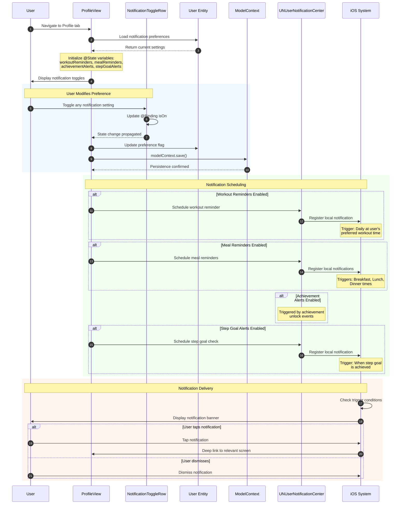

# Sequence Diagram: Notification System Overview

## Scientific Paper Description

Figure X presents the comprehensive sequence diagram for the notification management system within the WorkHome fitness application. The notification architecture implements a preference-based toggle system that allows users to customize their notification experience across four distinct categories: Workout Reminders, Meal Reminders, Achievement Alerts, and Step Goal Alerts. The system employs SwiftUI's declarative state management through @State properties bound to Toggle components, enabling real-time visual feedback as users modify their notification preferences. Each notification category serves a specific purpose in maintaining user engagement and supporting fitness goal adherence through timely, contextual reminders.

The notification preference persistence layer utilizes SwiftData's @Model architecture, where boolean flags (workoutReminders, mealReminders, achievementAlerts, stepGoalAlerts) are stored as properties of the User entity. This design ensures that notification preferences survive application restarts and are synchronized with the user's profile data. The implementation follows the observer pattern through SwiftUI's @Binding mechanism, where changes to toggle states in the ProfileView are propagated to the underlying User model and persisted via the ModelContext. The notification scheduling itself leverages iOS's UserNotifications framework, which manages local notification delivery based on the enabled preferences and trigger conditions specific to each notification category.

## Flow Description
This diagram shows the overall notification system architecture and how users manage their notification preferences.

## Mermaid Sequence Diagram



## Notification Categories

| Category | Icon | Purpose | Default | Trigger Type |
|----------|------|---------|---------|--------------|
| **Workout Reminders** | 🔔 | Remind to exercise | ON | Time-based (daily) |
| **Meal Reminders** | 🍴 | Log meals on time | ON | Time-based (3x daily) |
| **Achievement Alerts** | 🏆 | Celebrate milestones | ON | Event-based |
| **Step Goal Alerts** | 🚶 | Step goal progress | OFF | Threshold-based |

## Components Involved

| Component | Type | Responsibility |
|-----------|------|----------------|
| **User** | Actor | Manages notification preferences |
| **ProfileView** | SwiftUI View | Displays and manages toggles |
| **NotificationToggleRow** | SwiftUI View | Individual toggle component |
| **User Entity** | SwiftData @Model | Stores preference flags |
| **ModelContext** | SwiftData | Persists preference changes |
| **UNUserNotificationCenter** | iOS Framework | Schedules/delivers notifications |
| **iOS System** | Operating System | Displays notification banners |

## State Management

```swift
// ProfileView.swift
struct ProfileView: View {
    @ObservedObject var authManager: AuthManager
    @Environment(\.modelContext) private var modelContext
    
    // Notification toggles (local state)
    @State private var workoutReminders: Bool = true
    @State private var mealReminders: Bool = true
    @State private var achievementAlerts: Bool = true
    @State private var stepGoalAlerts: Bool = false
}
```

## User Model Preferences

```swift
// User.swift
@Model
final class User {
    // ... other properties
    
    // Notification Settings
    var workoutReminders: Bool
    var mealReminders: Bool
    var achievementAlerts: Bool
    var stepGoalAlerts: Bool
}
```

## Toggle Component

```swift
// NotificationToggleRow
struct NotificationToggleRow: View {
    let icon: String
    let label: String
    @Binding var isOn: Bool
    
    var body: some View {
        HStack {
            HStack(spacing: 12) {
                Image(systemName: icon)
                    .foregroundColor(.gray)
                    .frame(width: 24)
                Text(label)
            }
            
            Spacer()
            
            Toggle("", isOn: $isOn)
                .tint(.gradientStart)
        }
        .padding()
    }
}
```

## Notification Flow Architecture

```
┌─────────────────────────────────────────────────────────────┐
│              NOTIFICATION SYSTEM ARCHITECTURE               │
├─────────────────────────────────────────────────────────────┤
│                                                             │
│  ┌─────────────┐     ┌─────────────┐     ┌─────────────┐   │
│  │  ProfileView │────▶│  User Model │────▶│  SwiftData  │   │
│  │   Toggles   │◀────│  Preferences│◀────│  Persist    │   │
│  └──────┬──────┘     └─────────────┘     └─────────────┘   │
│         │                                                   │
│         ▼                                                   │
│  ┌─────────────────────────────────────────────────────┐   │
│  │           UNUserNotificationCenter                   │   │
│  ├─────────────────────────────────────────────────────┤   │
│  │                                                      │   │
│  │  ┌──────────┐ ┌──────────┐ ┌──────────┐ ┌────────┐  │   │
│  │  │ Workout  │ │   Meal   │ │Achievement│ │  Step  │  │   │
│  │  │ Reminder │ │ Reminder │ │  Alert   │ │  Goal  │  │   │
│  │  └────┬─────┘ └────┬─────┘ └────┬─────┘ └───┬────┘  │   │
│  │       │            │            │           │        │   │
│  └───────┼────────────┼────────────┼───────────┼────────┘   │
│          │            │            │           │            │
│          ▼            ▼            ▼           ▼            │
│  ┌─────────────────────────────────────────────────────┐   │
│  │                iOS Notification System               │   │
│  │                                                      │   │
│  │   🔔 Banner    📱 Lock Screen    🔊 Sound/Vibrate    │   │
│  │                                                      │   │
│  └─────────────────────────────────────────────────────┘   │
│                                                             │
└─────────────────────────────────────────────────────────────┘
```

## Code Summary Table

| # | Code Section | File | Purpose |
|---|--------------|------|---------|
| 1 | Notification @State vars | ProfileView.swift | Local toggle state management |
| 2 | User preference flags | User.swift | Persistent storage in SwiftData |
| 3 | `NotificationToggleRow` | ProfileView.swift | Reusable toggle component |
| 4 | Toggle @Binding | ProfileView.swift | Two-way data binding |
| 5 | modelContext.save() | ProfileView.swift | Persist preference changes |
