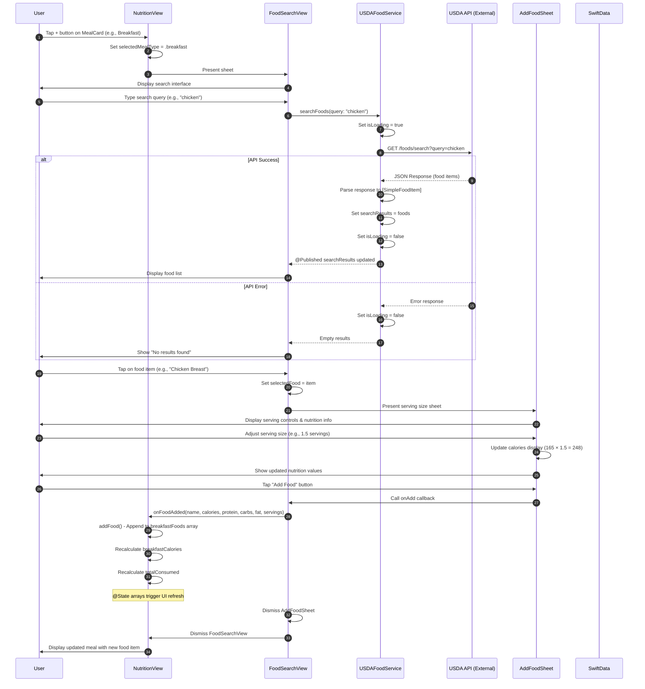

# Sequence Diagram: Searching & Logging Food

## Scientific Paper Description

Figure X illustrates the sequence diagram for the food searching and logging functionality within the WorkHome fitness application. This diagram demonstrates the interaction flow between the user interface layer, service layer, and external API when a user searches for and logs food items to their daily meal plan. The process begins when the user initiates a food search from the NutritionView, which triggers the presentation of the FoodSearchView component. Upon entering a search query, the application communicates with the USDAFoodService, an ObservableObject that manages asynchronous API requests to the USDA FoodData Central database. The service layer implements reactive programming patterns using the Combine framework, where @Published properties automatically propagate state changes to the SwiftUI views, ensuring real-time UI updates without manual intervention.

The sequence diagram further depicts the food selection and logging workflow, which employs a callback-based architecture for inter-component communication. When the user selects a food item and adjusts the serving size through the AddFoodSheet modal, the nutritional values are dynamically recalculated based on the selected portion. Upon confirmation, the food data is passed back to the NutritionView through a closure callback (onFoodAdded), which appends the item to the appropriate meal array based on the selected meal type (breakfast, lunch, dinner, or snack). This design pattern adheres to SwiftUI's unidirectional data flow principle, where state changes in @State variables automatically trigger view recomposition, providing users with immediate visual feedback of their logged food items and updated calorie totals.

## Flow Description
This diagram shows the interaction between components when a user searches for food and logs it to a meal.

## Mermaid Sequence Diagram



## Components Involved

| Component | Type | Responsibility |
|-----------|------|----------------|
| **User** | Actor | Initiates food search and logging |
| **NutritionView** | SwiftUI View | Main nutrition screen, manages meal state |
| **FoodSearchView** | SwiftUI View | Search interface, displays results |
| **USDAFoodService** | ObservableObject | API communication, search logic |
| **USDA API** | External Service | Food database (FoodData Central) |
| **AddFoodSheet** | SwiftUI View | Serving size selection, nutrition display |
| **SwiftData** | Persistence | (Future) Store logged foods |

## Key State Changes

1. **NutritionView State:**
   - `selectedMealType`: Tracks which meal (breakfast/lunch/dinner/snack)
   - `showFoodSearch`: Controls sheet presentation
   - `breakfastFoods`, `lunchFoods`, etc.: Arrays of logged foods

2. **FoodSearchView State:**
   - `searchText`: User's search query
   - `selectedFood`: Currently selected food item
   - `showAddModal`: Controls AddFoodSheet presentation

3. **USDAFoodService State:**
   - `searchResults`: Array of food items from API
   - `isLoading`: Loading indicator state

## Data Flow

```
User Input → FoodSearchView → USDAFoodService → USDA API
                                    ↓
User ← NutritionView ← FoodSearchView ← Search Results
                ↓
        Update @State arrays
                ↓
        UI automatically refreshes
```

## Key Implementation Code

### 1. API Service - Async Search Function
**File:** `USDAFoodService.swift`

This service implements the ObservableObject protocol with @Published properties for reactive UI updates:

```swift
class USDAFoodService: ObservableObject {
    static let shared = USDAFoodService()
    
    @Published var searchResults: [USDAFood] = []
    @Published var isLoading: Bool = false
    @Published var errorMessage: String?
    
    private let apiKey = Constants.usdaAPIKey
    private let baseURL = Constants.usdaBaseURL
    
    // MARK: - Search Foods
    func searchFoods(query: String) async {
        guard !query.isEmpty, query.count >= 2 else {
            await MainActor.run { self.searchResults = [] }
            return
        }
        
        await MainActor.run {
            self.isLoading = true
            self.errorMessage = nil
        }
        
        let urlString = "\(baseURL)/foods/search?api_key=\(apiKey)&query=\(query)&pageSize=20"
        
        do {
            let (data, response) = try await URLSession.shared.data(from: url)
            let searchResponse = try JSONDecoder().decode(USDASearchResponse.self, from: data)
            
            await MainActor.run {
                self.searchResults = searchResponse.foods ?? []
                self.isLoading = false
            }
        } catch {
            await MainActor.run {
                self.isLoading = false
                self.errorMessage = error.localizedDescription
            }
        }
    }
}
```

### 2. Real-Time Search Trigger
**File:** `FoodSearchView.swift`

The onChange modifier triggers API calls as the user types:

```swift
TextField("Search for food...", text: $searchText)
    .onChange(of: searchText) { _, newValue in
        Task {
            await foodService.searchFoods(query: newValue)
        }
    }
```

### 3. Displaying Search Results
**File:** `FoodSearchView.swift`

Reactive UI automatically updates when @Published searchResults changes:

```swift
if foodService.isLoading {
    ProgressView()
    Text("Searching USDA database...")
}
else if !foodService.searchResults.isEmpty {
    ForEach(foodService.searchResults) { food in
        FoodResultRow(
            name: food.name,
            calories: food.calories,
            serving: food.servingSizeText
        ) {
            selectedFood = SimpleFoodItem(
                name: food.name,
                calories: food.calories,
                protein: food.protein,
                carbs: food.carbs,
                fat: food.fat
            )
            showAddModal = true
        }
    }
}
```

### 4. Adding Food via Callback Pattern
**File:** `NutritionView.swift`

Closure-based callback passes food data from child to parent view:

```swift
func addFood(name: String, calories: Int, protein: Double, 
             carbs: Double, fat: Double, servings: Double) {
    let servingText = servings == 1.0 ? "1 serving" : "\(servings) servings"
    let foodTuple = (name, servingText, calories)
    
    switch selectedMealType {
    case .breakfast: breakfastFoods.append(foodTuple)
    case .lunch:     lunchFoods.append(foodTuple)
    case .dinner:    dinnerFoods.append(foodTuple)
    case .snack:     snackFoods.append(foodTuple)
    }
}
```

### 5. Sheet Presentation with Callback Binding
**File:** `NutritionView.swift`

The sheet passes the callback function to enable data flow back to parent:

```swift
.sheet(isPresented: $showFoodSearch) {
    FoodSearchView(mealType: selectedMealType, onFoodAdded: addFood)
        .id(selectedMealType.id)
}
```

## Code Summary Table

| # | Code Section | File | Purpose |
|---|--------------|------|---------|
| 1 | `USDAFoodService.searchFoods()` | USDAFoodService.swift | Async API call with @Published state |
| 2 | `TextField.onChange` | FoodSearchView.swift | Real-time search trigger |
| 3 | `ForEach(searchResults)` | FoodSearchView.swift | Reactive results display |
| 4 | `addFood()` function | NutritionView.swift | Meal-specific food storage |
| 5 | `.sheet()` with callback | NutritionView.swift | Parent-child data binding |
