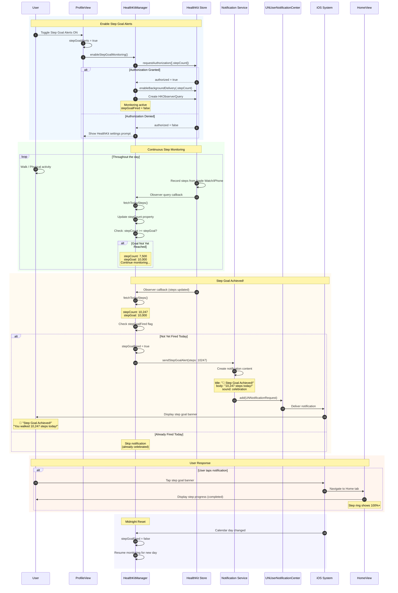

# Sequence Diagram: Step Goal Alerts

## Scientific Paper Description

Figure X presents the sequence diagram for the Step Goal Alerts notification subsystem within the WorkHome fitness application. This notification category implements a threshold-based triggering mechanism that monitors the user's daily step count through HealthKit integration and delivers celebratory notifications when the configured step goal is achieved. Unlike scheduled time-based reminders, step goal alerts require continuous background monitoring of health data, demonstrating the application's integration with iOS health frameworks. The default step goal of 10,000 steps aligns with widely-recognized physical activity recommendations, though the system is designed to accommodate user-configurable targets.

The step goal alert architecture leverages HealthKit's observer query capabilities to receive real-time updates on step count changes. When the HealthKitManager detects that the user's cumulative daily steps have crossed the goal threshold, it triggers the NotificationService to dispatch a congratulatory notification. This implementation employs a "fired" flag pattern to prevent duplicate notifications within the same day—once the step goal is achieved and the alert is sent, the system marks the goal as completed for that calendar day and resets at midnight. The notification content includes motivational messaging and the actual step count, providing positive reinforcement that encourages continued physical activity. This feature is disabled by default (stepGoalAlerts = false) as it requires HealthKit authorization and may be considered intrusive by users who prefer passive step tracking.

## Flow Description
This diagram shows how Step Goal Alerts monitor HealthKit data and notify users when they reach their daily step goal.

## Mermaid Sequence Diagram



## Components Involved

| Component | Type | Responsibility |
|-----------|------|----------------|
| **User** | Actor | Physical activity, receives alert |
| **ProfileView** | SwiftUI View | Manages toggle state |
| **HealthKitManager** | ObservableObject | Monitors step count |
| **HealthKit Store** | iOS Framework | Provides step data |
| **NotificationService** | Service Class | Sends goal notification |
| **UNUserNotificationCenter** | iOS Framework | Delivers notification |
| **HomeView** | SwiftUI View | Displays step progress |

## Step Goal Configuration

| Property | Default Value | Description |
|----------|---------------|-------------|
| **stepGoal** | 10,000 | Daily step target |
| **stepGoalAlerts** | false | Disabled by default |
| **stepGoalFired** | false | Reset daily at midnight |

## Key Implementation Code

### 1. Toggle State Binding
**File:** `ProfileView.swift`

```swift
@State private var stepGoalAlerts: Bool = false  // OFF by default

NotificationToggleRow(
    icon: "figure.walk", 
    label: "Step Goal Alerts", 
    isOn: $stepGoalAlerts
)
.onChange(of: stepGoalAlerts) { _, newValue in
    if newValue {
        HealthKitManager.shared.enableStepGoalMonitoring()
    } else {
        HealthKitManager.shared.disableStepGoalMonitoring()
    }
}
```

### 2. HealthKit Step Monitoring Setup
**File:** `HealthKitManager.swift`

Enable background step monitoring:

```swift
class HealthKitManager: ObservableObject {
    @Published var stepCount: Int = 0
    @Published var isAuthorized: Bool = false
    
    private var stepGoalFired: Bool = false
    private var observerQuery: HKObserverQuery?
    
    let stepGoal: Int = 10_000
    
    func enableStepGoalMonitoring() {
        guard let stepType = HKQuantityType.quantityType(
            forIdentifier: .stepCount
        ) else { return }
        
        // Enable background delivery
        healthStore.enableBackgroundDelivery(
            for: stepType,
            frequency: .immediate
        ) { success, error in
            if success {
                self.setupObserverQuery()
            }
        }
    }
}
```

### 3. Observer Query for Real-Time Updates
**File:** `HealthKitManager.swift`

Monitor step count changes:

```swift
private func setupObserverQuery() {
    guard let stepType = HKQuantityType.quantityType(
        forIdentifier: .stepCount
    ) else { return }
    
    observerQuery = HKObserverQuery(
        sampleType: stepType,
        predicate: nil
    ) { [weak self] query, completionHandler, error in
        
        Task {
            await self?.fetchTodaySteps()
            await self?.checkStepGoal()
        }
        
        completionHandler()
    }
    
    healthStore.execute(observerQuery!)
}
```

### 4. Check Step Goal & Send Alert
**File:** `HealthKitManager.swift`

Threshold check with duplicate prevention:

```swift
@MainActor
private func checkStepGoal() {
    // Check if goal reached and not already fired
    guard stepCount >= stepGoal,
          !stepGoalFired else { return }
    
    // Mark as fired for today
    stepGoalFired = true
    
    // Send notification
    NotificationService.shared.sendStepGoalAlert(steps: stepCount)
}
```

### 5. Send Step Goal Notification
**File:** `NotificationService.swift`

Celebratory notification delivery:

```swift
func sendStepGoalAlert(steps: Int) {
    let center = UNUserNotificationCenter.current()
    
    let content = UNMutableNotificationContent()
    content.title = "🎉 Step Goal Achieved!"
    content.body = "Amazing! You walked \(steps.formatted()) steps today!"
    content.sound = UNNotificationSound(
        named: UNNotificationSoundName("celebration.wav")
    )
    content.userInfo = ["destination": "home"]
    
    // Immediate delivery
    let trigger = UNTimeIntervalNotificationTrigger(
        timeInterval: 1,
        repeats: false
    )
    
    let request = UNNotificationRequest(
        identifier: "step_goal_\(Date().formatted(date: .numeric, time: .omitted))",
        content: content,
        trigger: trigger
    )
    
    center.add(request)
}
```

### 6. Daily Reset at Midnight
**File:** `HealthKitManager.swift`

Reset the fired flag for new day:

```swift
private func scheduleMidnightReset() {
    let calendar = Calendar.current
    let midnight = calendar.startOfDay(for: Date().addingTimeInterval(86400))
    
    let timer = Timer(fire: midnight, interval: 0, repeats: false) { [weak self] _ in
        self?.stepGoalFired = false
        self?.scheduleMidnightReset()  // Schedule next reset
    }
    
    RunLoop.main.add(timer, forMode: .common)
}
```

## Threshold-Based Architecture

```
┌─────────────────────────────────────────────────────────────┐
│              STEP GOAL ALERT ARCHITECTURE                   │
├─────────────────────────────────────────────────────────────┤
│                                                             │
│  ┌─────────────────────────────────────────────────────┐   │
│  │                 HealthKit Store                      │   │
│  │   Apple Watch + iPhone step data aggregation         │   │
│  └─────────────────────┬───────────────────────────────┘   │
│                        │                                    │
│                        ▼ HKObserverQuery                    │
│  ┌─────────────────────────────────────────────────────┐   │
│  │               HealthKitManager                       │   │
│  │                                                      │   │
│  │   stepCount: 10,247  ──▶  stepGoal: 10,000          │   │
│  │                              │                       │   │
│  │                              ▼                       │   │
│  │                    stepCount >= stepGoal?            │   │
│  │                       YES │    │ NO                  │   │
│  │                           │    └──▶ Continue         │   │
│  │                           ▼                          │   │
│  │                    stepGoalFired?                    │   │
│  │                     NO │    │ YES                    │   │
│  │                        │    └──▶ Skip (already sent) │   │
│  │                        ▼                             │   │
│  └────────────────────────┼─────────────────────────────┘   │
│                           │                                 │
│                           ▼                                 │
│  ┌─────────────────────────────────────────────────────┐   │
│  │             NotificationService                      │   │
│  │     sendStepGoalAlert(steps: 10247)                  │   │
│  └─────────────────────────────────────────────────────┘   │
│                           │                                 │
│                           ▼                                 │
│  ┌─────────────────────────────────────────────────────┐   │
│  │                 🎉 NOTIFICATION                      │   │
│  │          "Step Goal Achieved!"                       │   │
│  └─────────────────────────────────────────────────────┘   │
│                                                             │
└─────────────────────────────────────────────────────────────┘
```

## Code Summary Table

| # | Code Section | File | Purpose |
|---|--------------|------|---------|
| 1 | Toggle onChange | ProfileView.swift | Enable/disable monitoring |
| 2 | `enableStepGoalMonitoring()` | HealthKitManager.swift | Setup background delivery |
| 3 | `HKObserverQuery` | HealthKitManager.swift | Real-time step updates |
| 4 | `checkStepGoal()` | HealthKitManager.swift | Threshold check with flag |
| 5 | `sendStepGoalAlert()` | NotificationService.swift | Celebratory notification |
| 6 | Midnight reset | HealthKitManager.swift | Daily flag reset |
