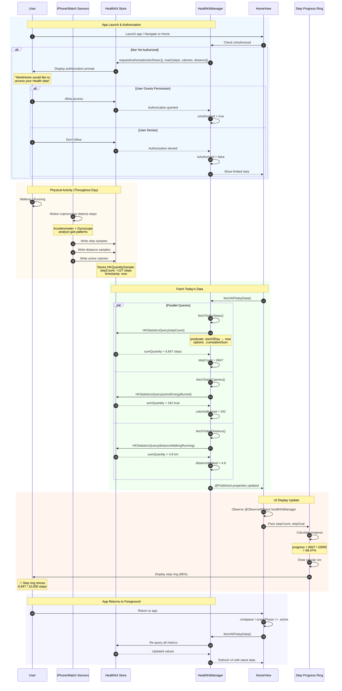

# Sequence Diagram: Step Tracking & HealthKit Integration

## Scientific Paper Description

Figure X presents the sequence diagram for the step tracking and HealthKit integration subsystem within the WorkHome fitness application. This implementation demonstrates the integration between a SwiftUI-based fitness application and Apple's HealthKit framework, enabling real-time access to health metrics collected by iPhone motion coprocessors and paired Apple Watch devices. The architecture employs a singleton pattern through HealthKitManager, which serves as the centralized interface for all health data operations. Upon application launch, the system initiates a HealthKit authorization flow that requests read permissions for step count, active energy burned, and walking/running distance—three complementary metrics that together provide a comprehensive picture of daily physical activity.

The data retrieval mechanism utilizes HKStatisticsQuery with cumulative sum aggregation, which efficiently calculates total daily values by aggregating samples from multiple sources (iPhone, Apple Watch, third-party devices). The query employs a date-based predicate filtering samples from the start of the current calendar day to the present moment, ensuring accurate daily totals that reset at midnight. The retrieved values are published through SwiftUI's @Published property wrappers, enabling automatic UI updates when health metrics change. The HomeView displays these metrics through a circular progress ring that visually represents step goal completion, with the progress percentage calculated as a computed property (stepCount / stepGoal). This reactive data binding pattern exemplifies the synergy between HealthKit's query-based data access model and SwiftUI's declarative UI framework.

## Flow Description
This diagram shows how step data flows from physical activity through HealthKit to the app's display.

## Mermaid Sequence Diagram



## Components Involved

| Component | Type | Responsibility |
|-----------|------|----------------|
| **User** | Actor | Physical activity, views progress |
| **iPhone/Watch Sensors** | Hardware | Motion detection via accelerometer/gyroscope |
| **HealthKit Store** | iOS Framework | Central repository for health data |
| **HealthKitManager** | ObservableObject | Singleton service for HealthKit queries |
| **HomeView** | SwiftUI View | Main dashboard displaying metrics |
| **Step Progress Ring** | SwiftUI View | Circular progress visualization |

## Health Metrics Tracked

| Metric | HealthKit Type | Unit | Display |
|--------|----------------|------|---------|
| **Steps** | `.stepCount` | count | "6,847 steps" |
| **Calories** | `.activeEnergyBurned` | kcal | "342 kcal" |
| **Distance** | `.distanceWalkingRunning` | km | "4.8 km" |

## Key Implementation Code

### 1. HealthKitManager Singleton
**File:** `HealthKitManager.swift`

Centralized health data service:

```swift
@MainActor
class HealthKitManager: ObservableObject {
    static let shared = HealthKitManager()
    
    private let healthStore = HKHealthStore()
    
    @Published var stepCount: Int = 0
    @Published var caloriesBurned: Double = 0
    @Published var distanceWalked: Double = 0
    @Published var isAuthorized: Bool = false
    
    private init() {}
}
```

### 2. Request HealthKit Authorization
**File:** `HealthKitManager.swift`

Request read access to health metrics:

```swift
func requestAuthorization() async -> Bool {
    guard HKHealthStore.isHealthDataAvailable() else {
        print("HealthKit is not available on this device")
        return false
    }
    
    let typesToRead: Set<HKObjectType> = [
        HKObjectType.quantityType(forIdentifier: .stepCount)!,
        HKObjectType.quantityType(forIdentifier: .activeEnergyBurned)!,
        HKObjectType.quantityType(forIdentifier: .distanceWalkingRunning)!
    ]
    
    do {
        try await healthStore.requestAuthorization(toShare: [], read: typesToRead)
        await MainActor.run {
            self.isAuthorized = true
        }
        return true
    } catch {
        print("HealthKit authorization failed: \(error.localizedDescription)")
        return false
    }
}
```

### 3. Fetch Today's Steps
**File:** `HealthKitManager.swift`

Query cumulative daily step count:

```swift
func fetchTodaySteps() async {
    guard let stepType = HKQuantityType.quantityType(forIdentifier: .stepCount) else { return }
    
    let now = Date()
    let startOfDay = Calendar.current.startOfDay(for: now)
    let predicate = HKQuery.predicateForSamples(
        withStart: startOfDay, 
        end: now, 
        options: .strictStartDate
    )
    
    let query = HKStatisticsQuery(
        quantityType: stepType, 
        quantitySamplePredicate: predicate, 
        options: .cumulativeSum
    ) { [weak self] _, result, error in
        guard let self = self, 
              error == nil, 
              let sum = result?.sumQuantity() else { return }
        
        let steps = Int(sum.doubleValue(for: HKUnit.count()))
        Task { @MainActor in
            self.stepCount = steps
        }
    }
    
    healthStore.execute(query)
}
```

### 4. Fetch All Today's Data
**File:** `HealthKitManager.swift`

Batch fetch all metrics:

```swift
func fetchAllTodayData() async {
    await fetchTodaySteps()
    await fetchTodayCalories()
    await fetchTodayDistance()
}
```

### 5. Step Progress Calculation
**File:** `HealthKitManager.swift`

Computed properties for UI binding:

```swift
var stepProgress: Double {
    Double(stepCount) / Double(Constants.defaultStepGoal)
}

var stepProgressPercentage: Int {
    Int(stepProgress * 100)
}
```

### 6. HomeView Integration
**File:** `HomeView.swift`

Observe and display health data:

```swift
struct HomeView: View {
    @ObservedObject var healthKitManager: HealthKitManager
    
    var body: some View {
        VStack {
            // Step Progress Ring
            CircularProgressView(
                progress: healthKitManager.stepProgress,
                lineWidth: 12
            )
            
            Text("\(healthKitManager.stepCount)")
                .font(.largeTitle)
                .fontWeight(.bold)
            
            Text("of \(Constants.defaultStepGoal) steps")
                .foregroundColor(.gray)
        }
        .onAppear {
            Task {
                await healthKitManager.fetchAllTodayData()
            }
        }
    }
}
```

## Data Flow Architecture

```
┌─────────────────────────────────────────────────────────────┐
│           STEP TRACKING DATA FLOW                           │
├─────────────────────────────────────────────────────────────┤
│                                                             │
│  ┌─────────────┐    ┌─────────────┐    ┌─────────────┐     │
│  │   SENSORS   │    │   SENSORS   │    │   SENSORS   │     │
│  │   iPhone    │    │ Apple Watch │    │  3rd Party  │     │
│  └──────┬──────┘    └──────┬──────┘    └──────┬──────┘     │
│         │                  │                  │             │
│         └────────────┬─────┴──────────────────┘             │
│                      ▼                                      │
│  ┌─────────────────────────────────────────────────────┐   │
│  │                 HEALTHKIT STORE                      │   │
│  │                                                      │   │
│  │   ┌──────────┐  ┌──────────┐  ┌──────────────┐      │   │
│  │   │  Steps   │  │ Calories │  │   Distance   │      │   │
│  │   │ Samples  │  │ Samples  │  │   Samples    │      │   │
│  │   └──────────┘  └──────────┘  └──────────────┘      │   │
│  │                                                      │   │
│  └─────────────────────┬───────────────────────────────┘   │
│                        │ HKStatisticsQuery                  │
│                        ▼                                    │
│  ┌─────────────────────────────────────────────────────┐   │
│  │              HEALTHKITMANAGER                        │   │
│  │                                                      │   │
│  │   @Published stepCount: Int = 6847                   │   │
│  │   @Published caloriesBurned: Double = 342            │   │
│  │   @Published distanceWalked: Double = 4.8            │   │
│  │                                                      │   │
│  └─────────────────────┬───────────────────────────────┘   │
│                        │ @ObservedObject                    │
│                        ▼                                    │
│  ┌─────────────────────────────────────────────────────┐   │
│  │                   HOMEVIEW                           │   │
│  │                                                      │   │
│  │   ┌─────────────────────────────────────────────┐   │   │
│  │   │         STEP PROGRESS RING                  │   │   │
│  │   │                                             │   │   │
│  │   │            ╭───────────╮                    │   │   │
│  │   │           ╱    68%     ╲                   │   │   │
│  │   │          │   6,847     │                   │   │   │
│  │   │          │   steps     │                   │   │   │
│  │   │           ╲            ╱                   │   │   │
│  │   │            ╰───────────╯                    │   │   │
│  │   │                                             │   │   │
│  │   └─────────────────────────────────────────────┘   │   │
│  │                                                      │   │
│  └─────────────────────────────────────────────────────┘   │
│                                                             │
└─────────────────────────────────────────────────────────────┘
```

## Query Pattern Explanation

```swift
// HKStatisticsQuery aggregates all samples in the date range
┌────────────────────────────────────────────────────────┐
│  Timeline: Start of Day ──────────────────────▶ Now    │
├────────────────────────────────────────────────────────┤
│                                                        │
│  Sample 1: +1,200 steps (morning walk)                 │
│  Sample 2: +500 steps (to office)                      │
│  Sample 3: +2,000 steps (lunch walk)                   │
│  Sample 4: +3,147 steps (afternoon activity)           │
│                                                        │
│  ─────────────────────────────────────────────────     │
│  Cumulative Sum: 6,847 steps                           │
│                                                        │
└────────────────────────────────────────────────────────┘
```

## Code Summary Table

| # | Code Section | File | Purpose |
|---|--------------|------|---------|
| 1 | `HealthKitManager` singleton | HealthKitManager.swift | Centralized health data service |
| 2 | `requestAuthorization()` | HealthKitManager.swift | Request HealthKit permissions |
| 3 | `fetchTodaySteps()` | HealthKitManager.swift | Query daily cumulative steps |
| 4 | `fetchAllTodayData()` | HealthKitManager.swift | Batch fetch all metrics |
| 5 | `stepProgress` computed | HealthKitManager.swift | Calculate goal percentage |
| 6 | HomeView integration | HomeView.swift | Display with @ObservedObject |
