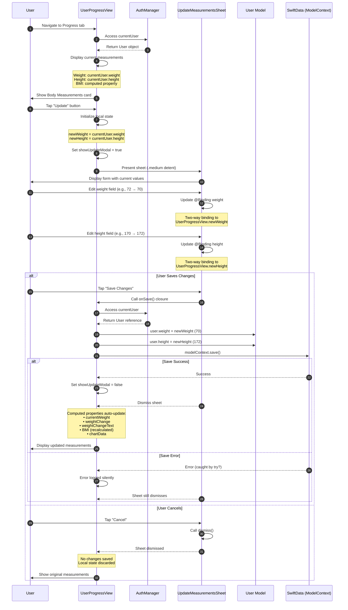

# Sequence Diagram: Updating Body Measurements

## Scientific Paper Description

Figure X illustrates the sequence diagram for the body measurements update functionality within the WorkHome fitness application. This feature enables users to track their physical progress by updating weight and height values through a modal interface presented from the UserProgressView. The process initiates when the user taps the "Update" button in the Body Measurements section, which triggers state initialization by loading the current user's weight and height values from the AuthManager into local @State variables. This approach ensures that the UpdateMeasurementsSheet displays pre-populated fields with existing data, providing users with a clear reference point for their modifications while maintaining a separation between the view's temporary editing state and the persistent data model.

The update mechanism employs SwiftUI's two-way data binding through @Binding properties, allowing real-time synchronization between the UpdateMeasurementsSheet's input fields and the parent view's state variables. Upon confirmation via the "Save Changes" button, the onSave closure executes the persistence logic, directly mutating the User model's weight and height properties through the AuthManager's currentUser reference. The SwiftData ModelContext's save() method is then invoked to persist these changes to the underlying data store. Following successful persistence, the UI automatically reflects the updated values due to SwiftUI's reactive architecture—the computed properties for BMI calculation, weight change display, and chart data dynamically recalculate based on the modified user properties, demonstrating the framework's declarative data flow paradigm.

## Flow Description
This diagram shows the interaction flow when a user updates their body measurements (weight and height) in the Progress tab.

## Mermaid Sequence Diagram



## Components Involved

| Component | Type | Responsibility |
|-----------|------|----------------|
| **User** | Actor | Views and updates body measurements |
| **UserProgressView** | SwiftUI View | Main progress screen, manages update flow |
| **AuthManager** | ObservableObject | Provides access to current user data |
| **UpdateMeasurementsSheet** | SwiftUI View | Modal form for editing weight/height |
| **User Model** | SwiftData @Model | Persistent user entity with measurements |
| **SwiftData** | Persistence | ModelContext for saving changes |

## State Management

### UserProgressView State
```swift
@State private var showUpdateModal: Bool = false
@State private var newWeight: Double = 72
@State private var newHeight: Double = 170
@Environment(\.modelContext) private var modelContext
```

### UpdateMeasurementsSheet Bindings
```swift
@Binding var weight: Double  // Two-way bound to newWeight
@Binding var height: Double  // Two-way bound to newHeight
let onSave: () -> Void       // Closure for save action
```

## Computed Properties (Auto-Update on Save)

```swift
// These recalculate automatically when user.weight/height changes:

var currentWeight: Double {
    authManager.currentUser?.weight ?? 72
}

var weightChange: Double {
    currentWeight - startingWeight
}

var weightChangeText: String {
    // "-2 kg" or "+3 kg" based on change
}

// In User Model:
var bmi: Double {
    let heightInMeters = height / 100
    return weight / (heightInMeters * heightInMeters)
}

var bmiCategory: String {
    // "Underweight", "Normal", "Overweight", "Obese"
}
```

## Data Flow Summary

```
┌─────────────────────────────────────────────────────────┐
│                    UPDATE FLOW                          │
├─────────────────────────────────────────────────────────┤
│                                                         │
│  [Tap Update] → Initialize newWeight/newHeight          │
│       │                                                 │
│       ▼                                                 │
│  [Show Sheet] → Display with @Binding fields            │
│       │                                                 │
│       ▼                                                 │
│  [Edit Values] → Two-way binding updates state          │
│       │                                                 │
│       ▼                                                 │
│  [Save Changes] → onSave() closure triggered            │
│       │                                                 │
│       ▼                                                 │
│  [Update Model] → user.weight = newWeight               │
│                   user.height = newHeight               │
│       │                                                 │
│       ▼                                                 │
│  [Persist] → modelContext.save()                        │
│       │                                                 │
│       ▼                                                 │
│  [UI Refresh] → Computed properties recalculate         │
│                 SwiftUI re-renders affected views       │
│                                                         │
└─────────────────────────────────────────────────────────┘
```

## Key Implementation Code

### 1. State Variables for Update Flow
**File:** `UserProgressView.swift`

Parent view manages temporary state for the update sheet:

```swift
struct UserProgressView: View {
    @ObservedObject var authManager: AuthManager
    @Environment(\.modelContext) private var modelContext
    
    @State private var showUpdateModal: Bool = false
    @State private var newWeight: Double = 72
    @State private var newHeight: Double = 170
}
```

### 2. Update Button with State Initialization
**File:** `UserProgressView.swift`

Tapping Update initializes local state with current user values:

```swift
Button("Update") {
    newWeight = authManager.currentUser?.weight ?? 72
    newHeight = authManager.currentUser?.height ?? 170
    showUpdateModal = true
}
.font(.subheadline)
.foregroundColor(.gradientStart)
```

### 3. Sheet with Save Closure
**File:** `UserProgressView.swift`

The sheet presents the form and handles persistence on save:

```swift
.sheet(isPresented: $showUpdateModal) {
    UpdateMeasurementsSheet(
        weight: $newWeight,
        height: $newHeight,
        onSave: {
            if let user = authManager.currentUser {
                user.weight = newWeight
                user.height = newHeight
                try? modelContext.save()
            }
            showUpdateModal = false
        }
    )
    .presentationDetents([.medium])
}
```

### 4. Two-Way Binding Form
**File:** `UserProgressView.swift`

The sheet uses @Binding for real-time synchronization with parent state:

```swift
struct UpdateMeasurementsSheet: View {
    @Binding var weight: Double
    @Binding var height: Double
    let onSave: () -> Void
    
    @Environment(\.dismiss) private var dismiss
    
    var body: some View {
        VStack(spacing: 24) {
            TextField("Weight", value: $weight, format: .number)
                .padding()
                .background(Color.gray.opacity(0.1))
                .cornerRadius(12)
            
            TextField("Height", value: $height, format: .number)
                .padding()
                .background(Color.gray.opacity(0.1))
                .cornerRadius(12)
            
            GradientButton("Save Changes") {
                onSave()
            }
        }
    }
}
```

### 5. Auto-Updating Computed Properties
**File:** `User.swift`

BMI recalculates automatically when weight/height change:

```swift
@Model
final class User {
    var height: Double
    var weight: Double
    
    var bmi: Double {
        let heightInMeters = height / 100
        return weight / (heightInMeters * heightInMeters)
    }
    
    var bmiCategory: String {
        switch bmi {
        case ..<18.5: return "Underweight"
        case 18.5..<25: return "Normal"
        case 25..<30: return "Overweight"
        default: return "Obese"
        }
    }
}
```

## Code Summary Table

| # | Code Section | File | Purpose |
|---|--------------|------|---------|
| 1 | State variables | UserProgressView.swift | Temporary edit state management |
| 2 | Update button action | UserProgressView.swift | Initialize state with current values |
| 3 | `.sheet()` with onSave | UserProgressView.swift | Persistence closure pattern |
| 4 | `UpdateMeasurementsSheet` | UserProgressView.swift | @Binding two-way data flow |
| 5 | `bmi` computed property | User.swift | Auto-recalculating derived values |
