# Sequence Diagram: Workout Reminders

## Scientific Paper Description

Figure X illustrates the sequence diagram for the Workout Reminders notification subsystem within the WorkHome fitness application. This notification category implements a time-based scheduling mechanism designed to encourage consistent exercise habits by delivering daily reminders at user-configured times. The system leverages iOS's UNUserNotificationCenter framework to schedule recurring local notifications that persist across application sessions. When enabled, the workout reminder creates a UNCalendarNotificationTrigger that fires at the specified time each day, prompting users to begin their exercise routine.

The workout reminder flow demonstrates the integration between user preference management and the iOS notification subsystem. Upon enabling the toggle in ProfileView, the application requests notification authorization if not previously granted, then constructs a UNNotificationRequest with appropriate content (title, body, sound) and a calendar-based trigger. The notification content is contextually relevant, displaying motivational messages and providing a direct entry point into the workout selection screen when tapped. This deep-linking capability enhances user experience by reducing friction between notification receipt and workout initiation, thereby supporting the application's core goal of promoting regular physical activity.

## Flow Description
This diagram shows how Workout Reminders are scheduled, delivered, and handled when the user interacts with them.

## Mermaid Sequence Diagram

```mermaid
sequenceDiagram
    autonumber
    
    participant User
    participant ProfileView
    participant NotificationService as Notification Service
    participant UNCenter as UNUserNotificationCenter
    participant iOS as iOS System
    participant WorkoutListView
    
    %% Enabling Workout Reminders
    rect rgb(240, 248, 255)
        Note over User,UNCenter: Enable Workout Reminders
        
        User->>ProfileView: Toggle Workout Reminders ON
        ProfileView->>ProfileView: workoutReminders = true
        ProfileView->>NotificationService: scheduleWorkoutReminder()
        
        NotificationService->>UNCenter: requestAuthorization()
        
        alt Authorization Granted
            UNCenter-->>NotificationService: authorized = true
            
            NotificationService->>NotificationService: Create notification content
            Note over NotificationService: title: "Time to Workout! 💪"<br/>body: "Your daily workout awaits"<br/>sound: .default
            
            NotificationService->>NotificationService: Create calendar trigger
            Note over NotificationService: UNCalendarNotificationTrigger<br/>hour: 8, minute: 0<br/>repeats: true
            
            NotificationService->>UNCenter: add(UNNotificationRequest)
            UNCenter-->>NotificationService: Request scheduled
            
        else Authorization Denied
            UNCenter-->>NotificationService: authorized = false
            NotificationService-->>ProfileView: Show settings prompt
            ProfileView->>User: "Enable notifications in Settings"
        end
    end
    
    %% Notification Delivery
    rect rgb(240, 255, 240)
        Note over iOS,User: Daily Notification Delivery
        
        iOS->>iOS: Calendar trigger fires (8:00 AM)
        iOS->>iOS: Check notification authorization
        iOS->>User: Display notification banner
        Note over User: 🔔 "Time to Workout! 💪"<br/>"Your daily workout awaits"
    end
    
    %% User Interaction
    rect rgb(255, 245, 238)
        Note over User,WorkoutListView: User Response
        
        alt User taps notification
            User->>iOS: Tap notification banner
            iOS->>ProfileView: Launch app with userInfo
            ProfileView->>WorkoutListView: Navigate to Workout tab
            WorkoutListView->>User: Display workout options
        else User dismisses
            User->>iOS: Swipe to dismiss
            Note over iOS: Notification cleared
        else User ignores
            iOS->>iOS: Auto-dismiss after timeout
        end
    end
    
    %% Disabling Reminder
    rect rgb(255, 240, 240)
        Note over User,UNCenter: Disable Workout Reminders
        
        User->>ProfileView: Toggle Workout Reminders OFF
        ProfileView->>ProfileView: workoutReminders = false
        ProfileView->>NotificationService: cancelWorkoutReminder()
        NotificationService->>UNCenter: removePendingNotificationRequests(["workout_reminder"])
        UNCenter-->>NotificationService: Notifications cancelled
    end
```



## Components Involved

| Component | Type | Responsibility |
|-----------|------|----------------|
| **User** | Actor | Toggles preference, receives notification |
| **ProfileView** | SwiftUI View | Manages toggle state |
| **NotificationService** | Service Class | Schedules/cancels notifications |
| **UNUserNotificationCenter** | iOS Framework | Manages notification delivery |
| **iOS System** | Operating System | Displays banners, handles taps |
| **WorkoutListView** | SwiftUI View | Deep-link destination |

## Key Implementation Code

### 1. Toggle State Binding
**File:** `ProfileView.swift`

The toggle controls the notification preference:

```swift
@State private var workoutReminders: Bool = true

// In body:
NotificationToggleRow(
    icon: "bell.fill", 
    label: "Workout Reminders", 
    isOn: $workoutReminders
)
.onChange(of: workoutReminders) { _, newValue in
    if newValue {
        NotificationService.shared.scheduleWorkoutReminder()
    } else {
        NotificationService.shared.cancelWorkoutReminder()
    }
}
```

### 2. Request Notification Authorization
**File:** `NotificationService.swift`

Request permission before scheduling:

```swift
func requestAuthorization() async -> Bool {
    let center = UNUserNotificationCenter.current()
    
    do {
        let granted = try await center.requestAuthorization(
            options: [.alert, .sound, .badge]
        )
        return granted
    } catch {
        print("Authorization error: \(error)")
        return false
    }
}
```

### 3. Schedule Workout Reminder
**File:** `NotificationService.swift`

Create and schedule the daily notification:

```swift
func scheduleWorkoutReminder() {
    let center = UNUserNotificationCenter.current()
    
    // Create content
    let content = UNMutableNotificationContent()
    content.title = "Time to Workout! 💪"
    content.body = "Your daily workout awaits. Let's crush those goals!"
    content.sound = .default
    content.userInfo = ["destination": "workout"]
    
    // Create trigger (daily at 8:00 AM)
    var dateComponents = DateComponents()
    dateComponents.hour = 8
    dateComponents.minute = 0
    
    let trigger = UNCalendarNotificationTrigger(
        dateMatching: dateComponents, 
        repeats: true
    )
    
    // Create request
    let request = UNNotificationRequest(
        identifier: "workout_reminder",
        content: content,
        trigger: trigger
    )
    
    // Schedule
    center.add(request) { error in
        if let error = error {
            print("Error scheduling: \(error)")
        }
    }
}
```

### 4. Cancel Workout Reminder
**File:** `NotificationService.swift`

Remove scheduled notification when disabled:

```swift
func cancelWorkoutReminder() {
    let center = UNUserNotificationCenter.current()
    center.removePendingNotificationRequests(
        withIdentifiers: ["workout_reminder"]
    )
}
```

### 5. Handle Notification Tap (Deep Link)
**File:** `AppDelegate.swift` or `SceneDelegate.swift`

Navigate to workout screen when notification is tapped:

```swift
func userNotificationCenter(
    _ center: UNUserNotificationCenter,
    didReceive response: UNNotificationResponse
) async {
    let userInfo = response.notification.request.content.userInfo
    
    if let destination = userInfo["destination"] as? String,
       destination == "workout" {
        // Navigate to workout tab
        NotificationCenter.default.post(
            name: .navigateToWorkout, 
            object: nil
        )
    }
}
```

## Notification Content

| Property | Value |
|----------|-------|
| **Identifier** | `workout_reminder` |
| **Title** | "Time to Workout! 💪" |
| **Body** | "Your daily workout awaits. Let's crush those goals!" |
| **Sound** | Default system sound |
| **Trigger** | Daily at 8:00 AM |
| **Repeats** | Yes |
| **Deep Link** | Workout tab |

## Code Summary Table

| # | Code Section | File | Purpose |
|---|--------------|------|---------|
| 1 | Toggle onChange | ProfileView.swift | Trigger schedule/cancel |
| 2 | `requestAuthorization()` | NotificationService.swift | Request iOS permission |
| 3 | `scheduleWorkoutReminder()` | NotificationService.swift | Create & schedule notification |
| 4 | `cancelWorkoutReminder()` | NotificationService.swift | Remove pending notification |
| 5 | `didReceive response` | AppDelegate.swift | Handle notification tap |
